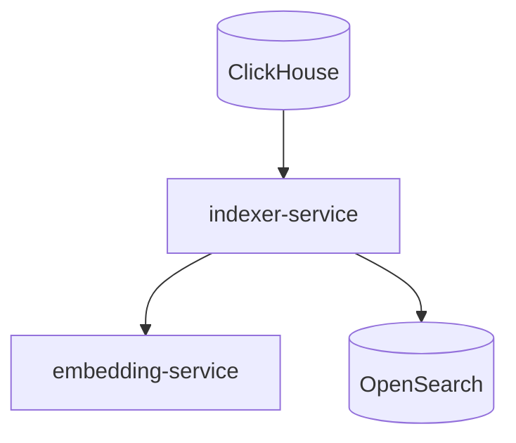
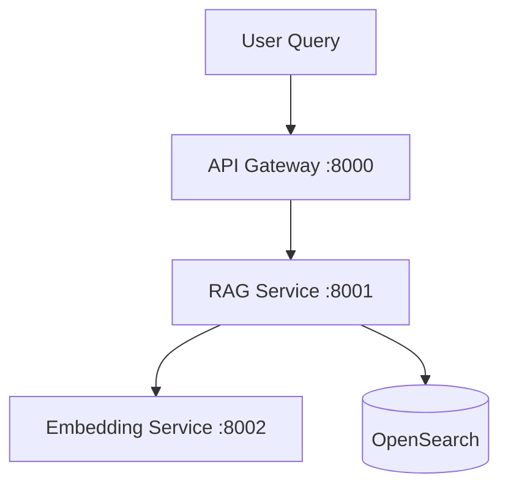
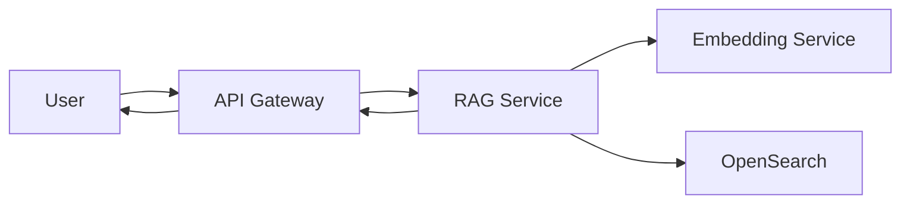

🧠 LEVEL 2 GOAL (what we are building)

In Level1 we built:

✔ Ingest GitHub data
✔ Generate embeddings
✔ Store in OpenSearch

That’s offline indexing

Level 2 adds this missing piece:

“Ask a question → retrieve relevant repos → return ranked results”

This is a RAG retrieval system (no LLM generation yet, just retrieval).


🧩 LEVEL 2 ARCHITECTURE (clean separation)

We split into 3 layers:

1. 🔵 Ingestion Layer (Level 1, unchanged)



2. 🟢 Query / RAG Retrieval Layer (NEW in Level 2)

This is the core of Level 2:



3. ⚙️ Internal Flow (what actually happens)

This is the most important part:

User Query
   ↓
API Gateway
   ↓
RAG Service
   ↓
1. Convert query → embedding (embedding-service)
   ↓
2. Vector search in OpenSearch
   ↓
3. Retrieve top K repos
   ↓
4. Return ranked results


🧠 What Level 2 DOES NOT include (important boundaries)

We are explicitly NOT doing yet:

❌ LLM response generation
❌ multi-step agents
❌ reranking models
❌ caching layer
❌ streaming ingestion

We will Keep it focused.

🔍 OpenSearch becomes our “vector database”

At Level 2, OpenSearch is used for:

- k-NN similarity search
- hybrid ranking (optional later)
- filtering (language, stars, etc.)

Query pattern we’ll implement:

```json
{
  "size": 5,
  "query": {
    "knn": {
      "embedding": {
        "vector": [...],
        "k": 5
      }
    }
  }
}
```

🧭 API DESIGN (Level 2 core contract)

API Gateway
POST /search
```json
{
  "query": "deep learning frameworks in python"
}
```

Response:
```json
{
  "results": [
    {
      "repo_name": "tensorflow/tensorflow",
      "description": "...",
      "score": 0.89
    }
  ]
}
```


🧱 Service responsibilities (clean separation)

🔹 embedding-service
    - input: text
    - output: vector
    - stateless

🔹 indexer-service (Level 1 only)
    - batch pipeline
    - should NOT run in Level 2 query path

🔹 RAG-service (NEW, Level 2 core)
    - takes query
    - calls embedding-service
    - queries OpenSearch
    - returns ranked results

🔹 API Gateway
    - routing only
    - no ML logic
    - future auth layer lives here


🚀 Level 2 system flow (final mental model)



🎯 Level 2 success criteria

We are done when:

✔ We can send a query
✔ It is embedded in real-time
✔ OpenSearch returns nearest vectors
✔ API returns ranked GitHub repos

That’s a real search engine.

⚠️ Key design decision (important)

We are currently doing:

embeddings at ingestion time

Level 2 adds:

embeddings at query time

This is the defining difference between Level 1 and Level 2
