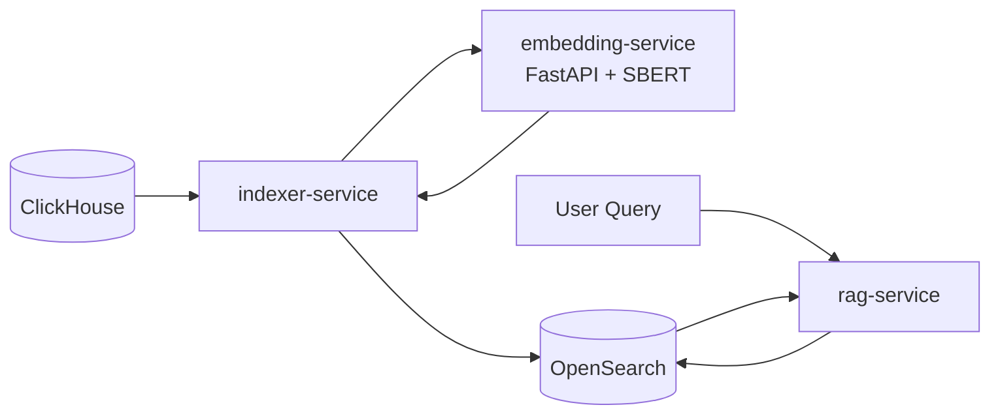
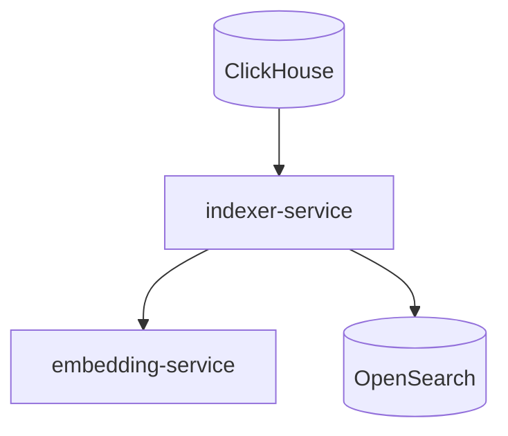
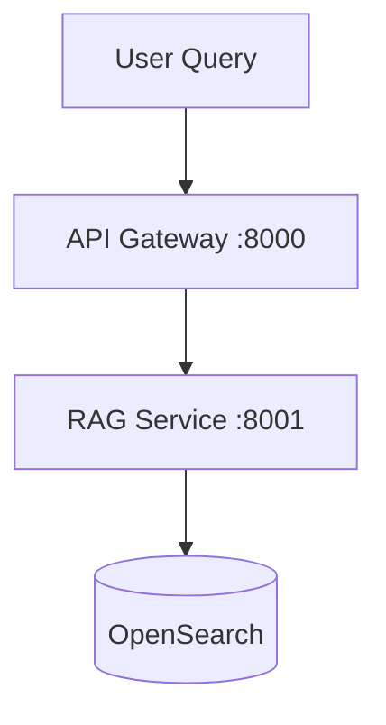
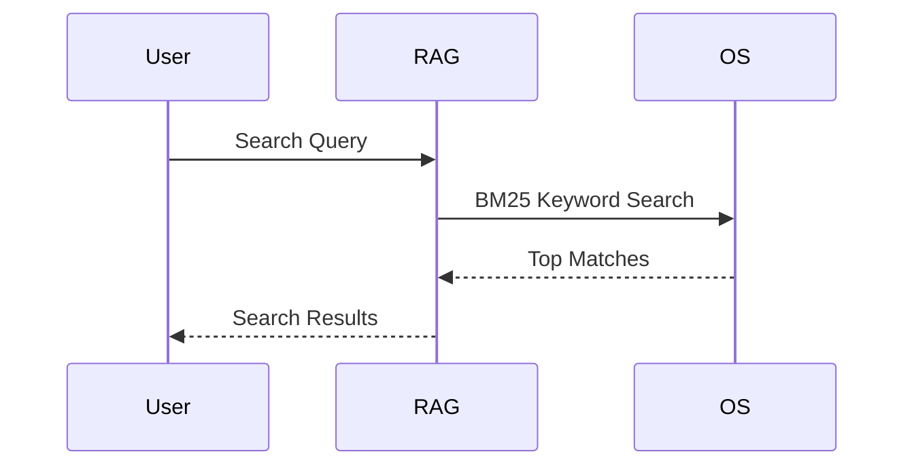

# AI Analytics Copilot — Level 2: Keyword (BM25) Retrieval (RAG layer) + Embedding Ingestion Pipeline


##  🧠 LEVEL 2 GOAL (what we are building)

In Level1 we built: 

- ✔ Ingest GitHub data
- ✔ Generate embeddings
- ✔ Store in OpenSearch

That’s offline indexing

Level 2 implements BM25-based retrieval over repository metadata stored in OpenSearch. Repository embeddings are generated and stored during ingestion, preparing the platform for semantic vector search in Level 3.

Level 2 adds this missing piece:

“Ask a question → retrieve relevant repos → return ranked results”

This is a RAG retrieval system (no LLM generation yet, just retrieval). i.e. Keyword Search & RAG Retrieval Layer which is Query-Time Embeddings & Retrieval System.


## 🧩 LEVEL 2 ARCHITECTURE (clean separation)



We split into 3 layers:

1. 🔵 Ingestion Layer (Level 1, unchanged)



2. 🟢 Query / RAG Retrieval Layer (NEW in Level 2)

This is the core of Level 2:



3. ⚙️ Internal Flow (what actually happens)

This is the most important part:

User Query
   ↓
API Gateway
   ↓
RAG Service
   ↓
BM25 Search in OpenSearch
   ↓
Retrieve Top K Repositories
   ↓
Return Ranked Results


## 🧠 What Level 2 DOES NOT include (important boundaries)

We are explicitly NOT doing yet:

- ❌ Semantic vector search
- ❌ LLM response generation
- ❌ multi-step agents
- ❌ reranking models
- ❌ caching layer
- ❌ streaming ingestion

We will Keep it focused.

## 🔍 OpenSearch acts us our search engine / search index.

At Level 2, OpenSearch is used for:

- Full-text search engine
- Inverted index
- BM25 ranking engine
- Document store

Query pattern we’ll implement:

```json
{
    "size": 5,
    "query": {
        "multi_match": {
            "query": query,
            "fields": [
                "description",
                "repo_name",
                "language"
             ]
        }
    }
}
```

## 🧭 API DESIGN (Level 2 core contract)

API Gateway
POST /search
```json
{
  "query": "deep learning frameworks in python"
}
```

Response:
```json
{
  "results": [
    {
      "repo_name": "tensorflow/tensorflow",
      "description": "...",
      "score": 0.89
    }
  ]
}
```


## 🧱 Service responsibilities (clean separation)

🔹 embedding-service
   - input: text
   - output: dense embedding vector (SBERT)
   - stateless

🔹 indexer-service (Level 1 only)
   - batch ingestion pipeline (ClickHouse → OpenSearch)
   - generates embeddings for documents
   - must NOT be used in query-time retrieval path

🔹 RAG-service (Level 2 core)
   - receive user query
   - execute BM25 keyword search over OpenSearch repository index
   - return top matching repositories

🔹 API Gateway
   - request routing only
   - no ML / retrieval logic
   - future auth, rate limiting, observability layer


## 🚀 Level 2 system flow (final mental model)




## Level 2 Deliverables

✅ ClickHouse ingestion

✅ Embedding generation using SBERT

✅ Embedding FastAPI service

✅ OpenSearch document indexing

✅ Duplicate prevention via repo_name IDs

✅ BM25 keyword retrieval API

✅ End-to-end retrieval pipeline

✅ Embeddings persisted for future semantic search


## 🎯 Level 2 success criteria

We are done when:

- ✔ We can send a natural language query to the RAG service
- ✔ OpenSearch performs BM25 full-text search using multi_match
- ✔ Queries are matched against repository metadata fields (description, repo_name, language)
- ✔ Top-K relevant GitHub repositories are returned
- ✔ Results are ranked using OpenSearch relevance scoring
- ✔ End-to-end flow works: Query → OpenSearch → Ranked results API

That’s a real search engine.

## ⚠️ Level2 Key design decision (important)

Level 2 is intentionally designed as a **lexical retrieval system using OpenSearch BM25**, not a semantic or vector-based search system.

Even though embeddings are generated during ingestion (for future use), **they are not used in the query-time retrieval path in Level 2**.

---

### 🔴 Critical decision

- OpenSearch is used as a **full-text search engine (BM25 via `multi_match`)**
- Query-time retrieval is based purely on:
  - `description`
  - `repo_name`
  - `language`
- Ranking is driven by **lexical relevance scoring (BM25) only**

---

### 🧠 Why this matters

- Keeps Level 2 simple, deterministic, and debuggable
- Separates concerns clearly:
  - ingestion = enrichment (embeddings optional)
  - retrieval = keyword search
- Avoids premature complexity of hybrid or vector search systems
- Establishes a strong baseline before introducing semantic retrieval in Level 3

---

### 🚫 What Level 2 is NOT

- Not a vector search system
- Not using k-NN similarity search
- Not a full semantic RAG system
- Not combining BM25 + embeddings (that comes later)

---

### 🟢 Outcome

Level 2 acts as a **traditional search-powered retrieval layer**, providing fast and explainable results, forming the foundation for future semantic and hybrid RAG upgrades.
