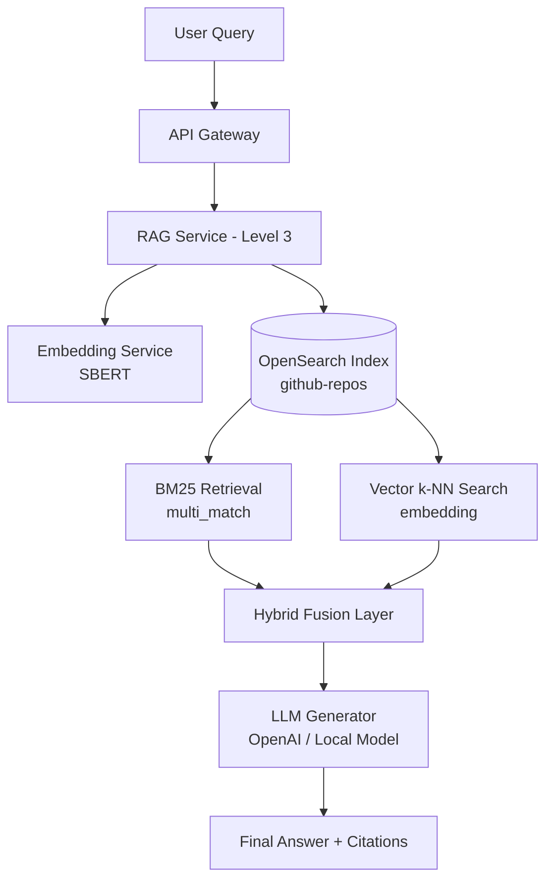
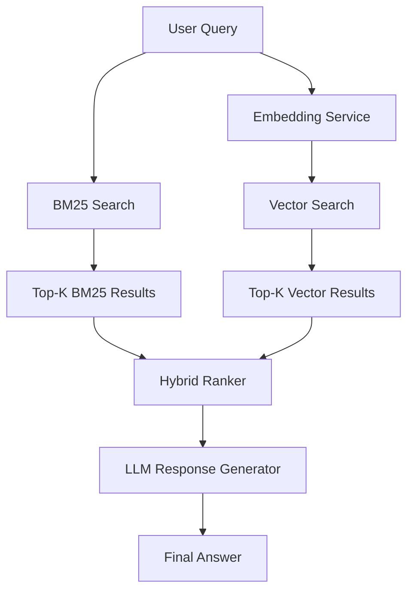

# AI Analytics Copilot — Level 3: True hybrid RAG pipeline


##  🚀 Level 3 Design (Hybrid RAG System)

In Level2 we extened level1 with these features: 
- ✔ OpenSearch BM25 full-text search (multi_match)
- ✔ Real-time query API for repository search
- ✔ Structured ingestion pipeline (ClickHouse → OpenSearch)
- ✔ Embedding generation during ingestion (stored for future use)
- ✔ Separation of ingestion and retrieval concerns

### 🎯 Goal of Level 3

Upgrade the system from keyword search (Level 2) to a true hybrid RAG pipeline:
- BM25 keyword relevance (precision)
- vector similarity search (semantic recall)
- LLM-based answer generation (reasoning layer)

🧱 Core Idea:
Instead of choosing one retrieval method, Level 3 combines both:

```bash
BM25 score + Vector similarity score → fused ranking → LLM generation
```

## 🧠 System Architecture 



## 🔄 Retrieval Flow 




## 🔧 What changes in each service

### 🔹 embedding-service (unchanged)
   - still SBERT embeddings
   - used for:
     - query embedding
     - document embedding (optional future update)

### 🔹 OpenSearch (upgraded role)
Now becomes a hybrid search engine:

**Supports:**
- BM25 (multi_match)
- k-NN vector search

**Index mapping now includes:**
- text fields (repo_name, description, language)
- vector field (embedding)

### 🔹 RAG-service (Level 3 core upgrade)
Now responsible for:
1. Query embedding
2. BM25 retrieval
3. vector k-NN retrieval
4. score fusion
5. LLM generation


### 🔹 New component: Hybrid Ranker

This is the key Level 3 addition.

**Responsibilities:**
- normalize BM25 + vector scores
- combine scores (weighted or RRF)
- produce final ranked list

Example:

```bash
 final_score =
     0.4 * bm25_score +
     0.6 * vector_score
```

(or Reciprocal Rank Fusion later)

### 🔹 New component: LLM layer

Takes:

- top-K repositories
- user query

Outputs:

- natural language answer
- optionally structured citations

## 🧪 Level 3 API Flow

### POST /search

#### Request:

```json
{
  "query": "best deep learning frameworks"
}
```

#### Internal flow:
``` bash
User Query
   ↓
Embedding Service
   ↓
BM25 Search (OpenSearch)
   ↓
Vector Search (k-NN OpenSearch)
   ↓
Hybrid Ranker
   ↓
LLM Generation
   ↓
Final Response
```

#### Response:

