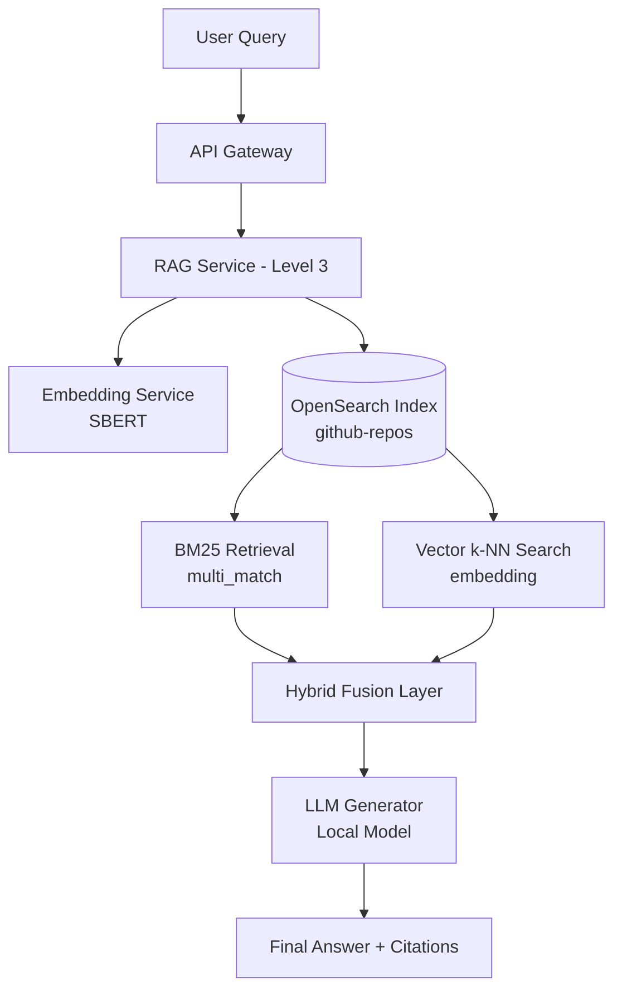
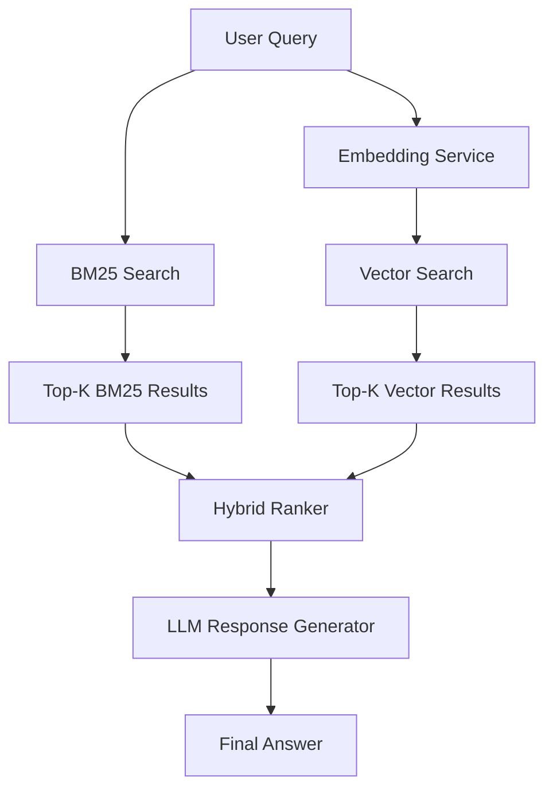
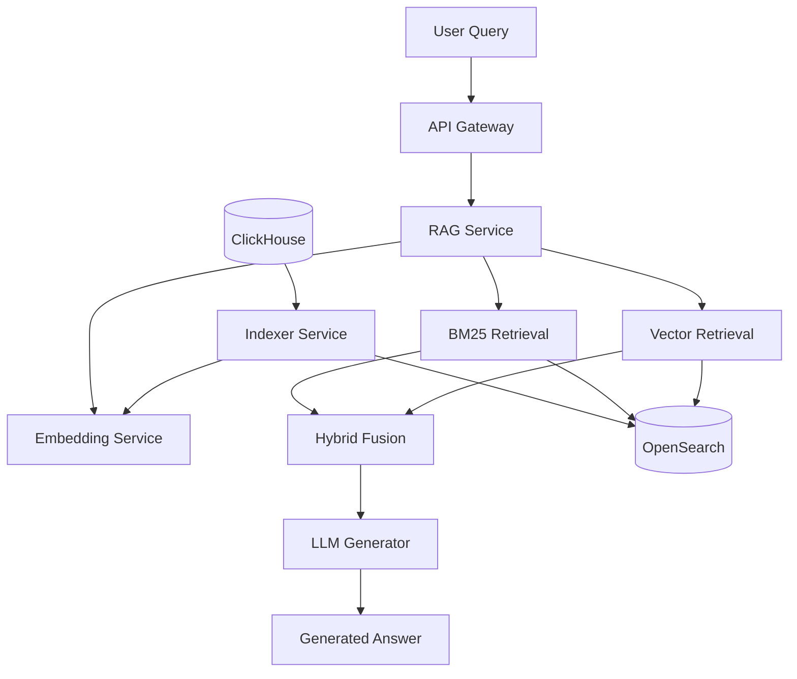

# AI Analytics Copilot — Level 3: True hybrid RAG pipeline


##  🚀 Level 3 Design (Hybrid RAG System)

In Level2 we extened level1 with these features: 
- ✔ OpenSearch BM25 full-text search (multi_match)
- ✔ Real-time query API for repository search
- ✔ Structured ingestion pipeline (ClickHouse → OpenSearch)
- ✔ Embedding generation during ingestion (stored for future use)
- ✔ Separation of ingestion and retrieval concerns

### 🎯 Goal of Level 3

Upgrade the system from keyword search (Level 2) to a true hybrid RAG pipeline:
- BM25 keyword relevance (precision)
- vector similarity search (semantic recall)
- LLM-based answer generation (reasoning layer)

🧱 Core Idea:
Instead of choosing one retrieval method, Level 3 combines both:

```bash
BM25 score + Vector similarity score → fused ranking → LLM generation
```

## 🧠 System Architecture 



## 🔄 Retrieval Flow 




## 🔧 What changes in each service

### 🔹 embedding-service (unchanged)
   - still SBERT embeddings
   - used for:
     - query embedding
     - document embedding (optional future update)

### 🔹 OpenSearch (upgraded role)
Now becomes a hybrid search engine:

**Supports:**
- BM25 (multi_match)
- k-NN vector search

**Index mapping now includes:**
- text fields (repo_name, description, language)
- vector field (embedding)

### 🔹 RAG-service (Level 3 core upgrade)
Now responsible for:
1. Query embedding
2. BM25 retrieval
3. vector k-NN retrieval
4. score fusion
5. LLM generation


### 🔹 New component: Hybrid Ranker

This is the key Level 3 addition.

**Responsibilities:**
- normalize BM25 + vector scores
- combine scores (weighted or RRF)
- produce final ranked list

Example:

```bash
 final_score =
     0.4 * bm25_score +
     0.6 * vector_score
```

(or Reciprocal Rank Fusion later)

### 🔹 New component: LLM layer

Takes:

- top-K repositories
- user query

Outputs:

- natural language answer
- optionally structured citations

## 🧪 Level 3 API Flow

### POST /search

#### Request:

```json
{
  "query": "best deep learning frameworks"
}
```

#### Internal flow:
``` bash
User Query
   ↓
Embedding Service
   ↓
BM25 Search (OpenSearch)
   ↓
Vector Search (k-NN OpenSearch)
   ↓
Hybrid Ranker
   ↓
LLM Generation
   ↓
Final Response
```

#### Response:

```json
{
  "query": "best deep learning frameworks",
  "results": [
    {
      "repo_name": "pytorch/pytorch",
      "score": 0.92,
      "reason": "Strong deep learning ecosystem with dynamic computation graph"
    }
  ],
  "answer": "PyTorch and TensorFlow are the leading frameworks..."
}
```

## 🧠 Key Design Shift (VERY IMPORTANT)
### Level 2
- OpenSearch = keyword search engine (BM25 only)
### Level 3
- OpenSearch = hybrid retrieval engine
    - BM25 (lexical)
    - k-NN (semantic)

👉 It is no longer “just search”
👉 It becomes a **retrieval brain**


## ⚠️ Critical Design Decision (Level 3)

We are now moving from “search engine” → “retrieval-augmented generation system”.

OpenSearch is no longer just a datastore:
it becomes a hybrid retrieval layer combining:

- lexical relevance (BM25)
- semantic similarity (vector k-NN)

The RAG service becomes the orchestration layer that:
- retrieves
- ranks
- generates

## 🚀 Level 3 success criteria

We are done when:

- ✔ BM25 + vector search both work in OpenSearch
- ✔ Hybrid ranking is implemented
- ✔ Query embedding is used at runtime
- ✔ Top-K merged results are returned
- ✔ LLM generates final answer from retrieved context


## Detailed design Level3

### Level 3 branch structure (services + new modules)

Since Level 2 is stable, Level 3 should be an evolution, not a rewrite.

#### 🎯 Level 3 Goal - recap

Transform:
```bash
User Query
    ↓
BM25 Search
    ↓
Results
```

into: 

```bash
User Query
    ↓
Hybrid Retrieval
(BM25 + Vector Search)
    ↓
Rank Fusion
    ↓
LLM Generation
    ↓
Natural Language Answer
```

#### 🏗️ Proposed Level 3 Branch Structure

We should avoid introducing new microservices unless they provide clear value.

##### Existing Services

```bash
apps/

├── api-gateway/
├── rag-service/
├── embedding-service/
├── indexer-service/
```
These remain.

### Level 3 Responsibilities

#### 🔹 embedding-service
No major changes.

**Current**
```bash
text
 ↓
embedding
```

**Used by**
- indexer-service
- rag-service

#### 🔹 indexer-service
Minor upgrade.

**Current**
```bash
ClickHouse
   ↓
embedding-service
   ↓
OpenSearch
```
**Level 3**
Same flow, but OpenSearch index must support:
```bash
description
repo_name
language
embedding_vector
```
No LLM logic here.

### 🔹 rag-service
This becomes the heart of Level 3.

**Current**
```bash
/search
   ↓
BM25
   ↓
results
```

**Level 3**

```bash
/search
   ↓
query embedding
   ↓
BM25 retrieval
   ↓
Vector retrieval
   ↓
Fusion
   ↓
  LLM
   ↓
Answer
```

## Recommended Internal Structure

Inside:
```bash
apps/rag-service/
```

create:
```bash
rag-service/

├── main.py

├── retrieval/
│   ├── bm25.py
│   ├── vector.py
│   └── hybrid.py

├── llm/
│

├── models/
│   └── schemas.py

└── clients/
    ├── opensearch_client.py
    └── embedding_client.py
```

## Module Responsibilities

**retrieval/bm25.py**

Responsible for:
```bash
query
  ↓
OpenSearch multi_match
  ↓
results
```

Example:
```bash
search_bm25(query)
```

**retrieval/vector.py**

Responsible for:
```bash
query
  ↓
embedding-service
  ↓
OpenSearch kNN
  ↓
results
```
Example:
```bash
search_vector(query)
```

**retrieval/hybrid.py**

Responsible for:
```bash
BM25 results
Vector results
     ↓
Fusion
     ↓
Ranked list
```
Example:
```bash
hybrid_search(query)
```

## Fusion Strategy

For Level 3 MVP:

Use:
```bash
Reciprocal Rank Fusion (RRF)
```

instead of weighted scores.

Reason:
- industry standard
- simple
- robust
- BM25 score and vector score use different scales

Formula:
```bash
RRF = Σ 1/(k + rank)
```
This avoids score normalization headaches.

**llm/generator.py**

New Level 3 capability.
Input:
```bash
query
+
top repositories
```

Output:
```bash
natural language answer
```
Example:
```bash
generate_answer(query, docs)
```

## LLM options

Level3 is fully local RAG , we will upgrade this to Cloud-hosted enterprise AI layer in Level4

Everything runs on out local machine:

Local model

Examples:
- Ollama
- LM Studio

Pros:
- no API costs

Cons:
- more setup

### Components

| Component      | Technology            |
| -------------- | --------------------- |
| Embeddings     | SBERT (existing)      |
| Search         | OpenSearch            |
| Hybrid Ranking | RRF                   |
| LLM            | Ollama                |
| Orchestration  | FastAPI (rag-service) |

**Why Ollama?**

We will use Ollama for Level 3 because:

- Runs locally on macOS/Linux/Windows
- Very simple API
- Docker-friendly
- No API keys
- Easy upgrade path later

for out project we will have Ollama runing as a container service inside Docker Compose
RAG service communicates via internal network (http://ollama:11434)

Example:

```bash
ollama pull llama3.2
```
or

```bash
ollama pull qwen3:8b
```

### Recommended Model

Given our project size:

**Option 1 (best balance)**

Qwen 3 8B

Pros:
- Excellent reasoning
- Good coding ability
- Runs well locally

**Option 2 (lighter)**

Llama 3.2 3B

Pros:
- Fast
- Low memory

Cons:
- Weaker answers

**Option 3 (strongest local)**

Llama 3.1 8B

Pros:
- Very capable

Cons:
- More RAM

### Level 3 Service Layout
We would add a new service:

```bash
apps/

api-gateway/
embedding-service/
indexer-service/
rag-service/

ollama/
```

Docker compose:
```bash
ollama:
  image: ollama/ollama
  container_name: ollama
  ports:
    - "11434:11434"
```

### RAG Service Evolution
Current Level 2:
```bash
query
 ↓
BM25
 ↓
results
```
Level 3:
```bash
query
 ↓
BM25
 ↓
Vector Search
 ↓
Hybrid Fusion
 ↓
Context Builder
 ↓
Local LLM
 ↓
Answer
```

### New Modules
Inside rag-service:

```bash
apps/
└── rag-service/
    ├── main.py

    ├── retrieval/
    │   ├── bm25.py
    │   ├── vector.py
    │   └── hybrid.py

    ├── llm/
    │   ├── generator.py
    │   └── prompts.py

    ├── models/
    │   └── schemas.py

    ├── clients/
    │   ├── opensearch_client.py
    │   ├── embedding_client.py
    │   └── ollama_client.py

    └── config.py
```

### Prompt Construction

Example context:
```bash
Repository: pytorch/pytorch
Description: PyTorch deep learning library

Repository: tensorflow/tensorflow
Description: Deep learning framework
```

Prompt:
```bash
Answer the user question using only the provided repositories.

Question:
Which deep learning framework should I use?

Repositories:
...

Answer:
```
This is a classic RAG pattern.


## API Contract Evolution

**Level 2**

Request

```json
{
  "query": "deep learning"
}
```

Response

```json
{
  "results": [...]
}
```

**Level 3**

Request
```json
{
  "query": "deep learning frameworks"
}
```
Response
```json
{
  "query": "deep learning frameworks",
  "answer": "PyTorch and TensorFlow are the leading deep learning frameworks...",
  "sources": [
    {
      "repo_name": "pytorch/pytorch"
    },
    {
      "repo_name": "tensorflow/tensorflow"
    }
  ]
}
```

### Level 3 Architecture




## 🎯 Level 3 Milestones

We will implement Level 3 in four small phases:

### Phase 1

OpenSearch vector index support
```bash
dense vector mapping
kNN enabled
```

### Phase 2

Vector search
```bash
query embedding
kNN retrieval
```

### Phase 3

Hybrid retrieval

```bash
BM25
+
Vector
+
RRF
```

```mermaid
flowchart TD
    U[User Query] --> RAG[RAG Service]

    RAG --> BM25[BM25 Search OpenSearch]
    RAG --> EMB[Embedding Service]
    EMB --> VEC[kNN Vector Search OpenSearch]

    BM25 --> FUSION[Hybrid Ranker (RRF)]
    VEC --> FUSION

    FUSION --> OUT[Final Ranked Results]
```

### Phase 4

LLM generation

```bash
retrieved context
↓
LLM
↓
answer
```
This keeps every phase independently testable and gives us a working checkpoint after each stage.

## 🎯 Level 3 Success Criteria

We are done when:

- ✔ OpenSearch supports vector search
- ✔ Query embeddings are generated at runtime
- ✔ BM25 retrieval works
- ✔ Vector retrieval works
- ✔ Hybrid ranking (RRF) works
- ✔ Retrieved repositories are used as context
- ✔ Local LLM generates answers
- ✔ No cloud-hosted AI services are required


## Level 4 (Future)

Then Level 4 becomes very clear:

```bash
Level 3
--------
Local Ollama

Level 4
--------
OpenAI / Claude / Bedrock
Model abstraction layer
Prompt management
Conversation memory
Streaming responses
```

So architecturally:

- Level 1: Data ingestion
- Level 2: BM25 retrieval
- Level 3: Hybrid RAG + local LLM
- Level 4: Cloud-hosted enterprise AI layer

That's a clean progression and a great learning journey.

