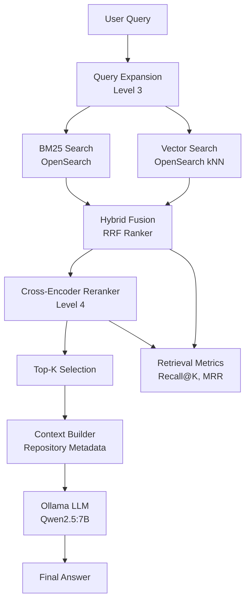
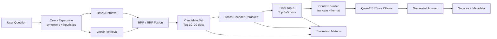

# Level 4 - Advanced RAG + Ranking Intelligence System

## 🎯 Objective

Level 4 enhances the Level 3 Hybrid RAG system by improving **ranking quality, retrieval evaluation, explainability, and response delivery**, without changing the core retrieval architecture.

Level 3 = build the system  
Level 4 = improve ranking quality and trustworthiness of results (Observable, measurable, and optimizable retrieval & ranking platform)


---
### Prerequisite:

Level 3 already provides:

- Query Expansion
- BM25 Retrieval
- Vector Retrieval
- Hybrid Fusion (RRF)
- Retrieval Debug Endpoint (/debug-retrieval)

Level 4 builds on top of this retrieval layer by introducing:

- Cross-Encoder Re-Ranking
- Retrieval Evaluation Metrics - BM25 retrieval (OpenSearch), Vector retrieval (OpenSearch kNN + embeddings service), Hybrid fusion using RRF
- Source Attribution
- Streaming Responses


## 🧠 Core Principle

Level 4 does NOT introduce new data sources or retrieval types.

Instead, it improves:

- Ranking quality
- Relevance precision
- Answer grounding
- Observability
- Response UX

---

## 🏗️ Architecture Overview



### Retrieval Layer (Level 3 → stabilized in Level 4)
- BM25 retrieval (OpenSearch)
- Vector retrieval (OpenSearch kNN + embeddings service)
- Hybrid fusion using RRF
👉 Output: candidate document pool

### Query Understanding Layer
#### Query expansion (rule-based)
- synonym expansion
- heuristic augmentation
Example:
```bash
deep learning framework
→ deep learning library toolkit API implementation
```

### Ranking Layer (Level 4 core upgrade)
- Cross-encoder reranker
Model:
```bash
cross-encoder/ms-marco-MiniLM-L-6-v2
```
### Purpose:
- refine ordering of hybrid results
- improve semantic relevance ordering
### Effect:
- ML frameworks correctly ranked above infra tools
- reduced noise from vector/BM25 fusion

## Context Construction Layer
- Top-K reranked documents selected
- repository metadata formatted as context
- strict context window enforcement

## LLM Generation Layer (Grounded RAG)
- Ollama (Qwen2.5:7B)
- answers generated ONLY from retrieved context
- no external knowledge injection

📊 2. Evaluation & Observability Layer (MAJOR LEVEL 4 FEATURE)

This is the biggest Level 4 upgrade.

Retrieval Metrics
Recall@K
Mean Reciprocal Rank (MRR)
Ranking Metrics
nDCG@K (baseline vs reranked comparison)
rank shift analysis
A/B Evaluation
Endpoints:
/eval-retrieval
/eval-batch-retrieval
/eval-reranker-ab
/eval-ranking-metrics
Outputs include:
baseline ranking
reranked ranking
metric deltas
Explainability Layer

Every query returns:

expanded query
BM25 results
vector results
fused results (RRF)
reranked results
scoring breakdown per stage

👉 Enables full traceability:

“why did this repo rank #1?”

📈 3. Key Level 4 Capabilities (Final Consolidated List)
✔ Retrieval Quality Improvements
hybrid BM25 + vector retrieval
query expansion improves recall
✔ Ranking Quality Improvements
cross-encoder reranking improves precision ordering
reduces semantic noise from fusion
✔ Explainability (Critical)
full pipeline transparency per query
score visibility across all stages
✔ Observability
evaluation endpoints
retrieval metrics
ranking metrics (MRR, nDCG)
✔ Grounded LLM Outputs
answers strictly constrained to retrieved context
eliminates hallucinated repositories
🧠 4. Design Principles (Level 4 Reality)
1. Retrieval is deterministic
no LLM dependency in retrieval stage
2. Ranking is multi-stage
BM25 + vector → RRF → reranker
3. Evaluation is first-class
metrics are not post-processing
they are part of system design
4. Explainability is built-in
every ranking decision is traceable
5. LLM is downstream only
LLM never influences retrieval decisions
🚫 Explicit Non-Goals (Important for clarity)

Level 4 DOES NOT include:

❌ multi-LLM routing
❌ memory systems
❌ agent workflows
❌ tool calling orchestration
❌ prompt management systems

(those belong to Level 5)

📌 Final Level 4 Definition
✔ Level 4 =

Hybrid Retrieval + Cross-Encoder Ranking + Evaluation + Observability + Grounded Generation

🏁 Level 4 Completion Criteria (Final)

You can tag level4_stable when:

✔ BM25 + vector + RRF working
✔ query expansion working
✔ cross-encoder reranker integrated
✔ eval endpoints operational
✔ ranking metrics (MRR, nDCG) working
✔ explainability fully exposed
✔ LLM grounded responses verified


---

## 🔧 Level 4 Enhancements

### 1. Cross-Encoder Re-ranking

After hybrid retrieval (RRF), a cross-encoder model re-scores candidate documents.

**Purpose:**
- Improve ranking precision
- Resolve ambiguity between similar results
- Improve final context quality for LLM

**Input:**
- Query
- Top-K hybrid retrieval results

**Output:**
- Re-ranked document list

**Model (local):**
- `cross-encoder/ms-marco-MiniLM-L-6-v2`

---

### 2. Retrieval Evaluation Metrics

Adds observability for retrieval quality.

#### Metrics supported:
- Recall@K
- MRR (Mean Reciprocal Rank)
- Hit Rate@K

#### Purpose:
- Evaluate retrieval effectiveness
- Debug query failures
- Compare BM25 vs Vector vs Hybrid

---

### 3. Source Citations (Explainability Layer)

Each LLM response includes:

- Re-ranked documents used
- Repository metadata
- Scores (BM25, vector, RRF, reranker)

**Output format example:**
```json
{
  "answer": "...",
  "sources": [
    {
      "repo_name": "...",
      "description": "...",
      "score": 0.82
    }
  ]
}
```
### 4. Optional Streaming Response Support

Improve UX by streaming LLM output from Ollama.

Two modes:
- Non-streaming (default, Level 3 behavior)
- Streaming tokens (Level 4 enhancement)


### 5. Advanced Retrieval Optimization

Lightweight improvements applied to existing pipeline:

**(A) Weighted RRF tuning**
- BM25 weight adjusted
- Vector weight slightly increased
**(B) Top-K compression before LLM**
- Only top 3–5 documents passed to LLM
**(C) Query-aware boosting (optional heuristic)**
- Boost matches in title/repo name


## 🔌 Component Changes
### New Module
```bash
retrieval/reranker.py
```

Responsible for:
- Cross-encoder scoring
- Re-ranking hybrid results

### Modified Modules

`retrieval/hybrid.py`
- Adds reranking step after RRF fusion

`llm/generator.py`
- Returns:
   - answer 
   - source documents (metadata)

`clients/ollama_client.py`
- Optional streaming support enabled

## 🔄 Data Flow (Final)



## 📊 Evaluation Strategy

Level 4 introduces offline and debug evaluation:
- Compare BM25 vs Vector vs Hybrid vs Reranked
- Track Recall@K
- Monitor ranking drift
- Identify failure queries

## 🧪 Debug Endpoints (Optional)
- /debug-retrieval
- /debug-rerank
- /eval-retrieval

## 🧱 Constraints
- ❌ No cloud LLM APIs (fully local)
- ❌ No LLM usage in retrieval stage
- ❌ No external reranking APIs

## 🧭 Position in System
- Level 1: Data ingestion
- Level 2: BM25 + embeddings foundation
- Level 3: Hybrid RAG + LLM + query expansion
- Level 4: Ranking + evaluation + explainability (this layer)
- Level 5: Multi-LLM + agents + memory

🚀 Outcome of Level 4

After completion, the system will have:
- Higher retrieval accuracy
- Better ranking quality
- Explainable AI outputs
- Observable retrieval performance
- Improved LLM grounding