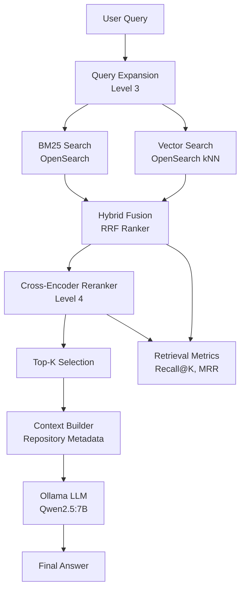
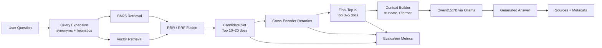

# Level 4 - Advanced RAG Optimization Layer

## 🎯 Objective

Level 4 enhances the Level 3 Hybrid RAG system by improving **ranking quality, retrieval evaluation, explainability, and response delivery**, without changing the core retrieval architecture.

Level 3 = build the system  
Level 4 = improve ranking quality and trustworthiness of results

---

## 🧠 Core Principle

Level 4 does NOT introduce new data sources or retrieval types.

Instead, it improves:

- Ranking quality
- Relevance precision
- Answer grounding
- Observability
- Response UX

---

## 🏗️ Architecture Overview




---

## 🔧 Level 4 Enhancements

### 1. Cross-Encoder Re-ranking

After hybrid retrieval (RRF), a cross-encoder model re-scores candidate documents.

**Purpose:**
- Improve ranking precision
- Resolve ambiguity between similar results
- Improve final context quality for LLM

**Input:**
- Query
- Top-K hybrid retrieval results

**Output:**
- Re-ranked document list

**Model (local):**
- `cross-encoder/ms-marco-MiniLM-L-6-v2`

---

### 2. Retrieval Evaluation Metrics

Adds observability for retrieval quality.

#### Metrics supported:
- Recall@K
- MRR (Mean Reciprocal Rank)
- Hit Rate@K

#### Purpose:
- Evaluate retrieval effectiveness
- Debug query failures
- Compare BM25 vs Vector vs Hybrid

---

### 3. Source Citations (Explainability Layer)

Each LLM response includes:

- Re-ranked documents used
- Repository metadata
- Scores (BM25, vector, RRF, reranker)

**Output format example:**
```json
{
  "answer": "...",
  "sources": [
    {
      "repo_name": "...",
      "description": "...",
      "score": 0.82
    }
  ]
}
```
### 4. Optional Streaming Response Support

Improve UX by streaming LLM output from Ollama.

Two modes:
- Non-streaming (default, Level 3 behavior)
- Streaming tokens (Level 4 enhancement)


### 5. Advanced Retrieval Optimization

Lightweight improvements applied to existing pipeline:

**(A) Weighted RRF tuning**
- BM25 weight adjusted
- Vector weight slightly increased
**(B) Top-K compression before LLM**
- Only top 3–5 documents passed to LLM
**(C) Query-aware boosting (optional heuristic)**
- Boost matches in title/repo name


## 🔌 Component Changes
### New Module
```bash
retrieval/reranker.py
```

Responsible for:
- Cross-encoder scoring
- Re-ranking hybrid results

### Modified Modules

`retrieval/hybrid.py`
- Adds reranking step after RRF fusion

`llm/generator.py`
- Returns:
   - answer 
   - source documents (metadata)

`clients/ollama_client.py`
- Optional streaming support enabled

## 🔄 Data Flow (Final)



## 📊 Evaluation Strategy

Level 4 introduces offline and debug evaluation:
- Compare BM25 vs Vector vs Hybrid vs Reranked
- Track Recall@K
- Monitor ranking drift
- Identify failure queries

## 🧪 Debug Endpoints (Optional)
- /debug-retrieval
- /debug-rerank
- /eval-retrieval

## 🧱 Constraints
- ❌ No cloud LLM APIs (fully local)
- ❌ No LLM usage in retrieval stage
- ❌ No external reranking APIs

## 🧭 Position in System
- Level 1: Data ingestion
- Level 2: BM25 + embeddings foundation
- Level 3: Hybrid RAG + LLM + query expansion
- Level 4: Ranking + evaluation + explainability (this layer)
- Level 5: Multi-LLM + agents + memory

🚀 Outcome of Level 4

After completion, the system will have:
- Higher retrieval accuracy
- Better ranking quality
- Explainable AI outputs
- Observable retrieval performance
- Improved LLM grounding