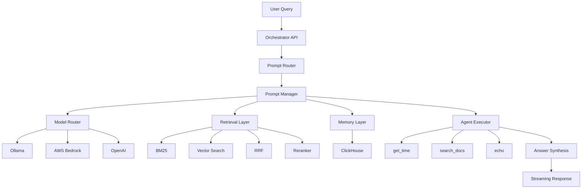

# AI Analytics Copilot – Level 5 - Enterprise AI Orchestration Layer

# AI Analytics Copilot – Level 5
# Enterprise AI Orchestration Layer

---

# 1. Vision

Level 5 transforms the platform from:

```text
Advanced RAG System
```

into:

```text
Enterprise AI Orchestration Platform
```

Retrieval is already solved in Levels 3–4.

Level 5 focuses on:

- LLM orchestration
- model routing
- memory
- prompt management
- tool execution
- agent workflows
- streaming

The platform becomes:

```text
AI Platform
=
Retrieval
+
Models
+
Memory
+
Tools
+
Agents
```

---

# 2. High-Level Architecture



---

# 3. Architectural Principles

## Reuse Existing Retrieval

Level 5 does not replace retrieval.

It reuses:

- BM25
- Vector Search
- Reciprocal Rank Fusion
- Cross Encoder Reranking

through:

```python
RagClient()
```

---

## Separation of Concerns

Each layer owns a single responsibility.

| Layer | Responsibility |
|---------|---------|
| Prompt Router | Intent Classification |
| Prompt Manager | Prompt Construction |
| Model Router | Model Selection |
| Retrieval | Knowledge Retrieval |
| Memory | Session Persistence |
| Agent Executor | Tool Orchestration |
| Streaming | Response Delivery |

---

# 4. Prompt Management System

Implemented:

```text
prompts/
├── system_prompt.py
├── rag_prompt.py
├── code_prompt.py
├── summary_prompt.py
├── agent_prompt.py
└── prompt_router.py
```

Prompt types:

```text
RAG
CODE
SUMMARY
AGENT
```

Benefits:

- centralized prompts
- reusable templates
- consistent behavior
- future versioning support

---

# 5. Model Routing Layer

Implemented:

```python
ModelRouter
```

Supported providers:

```text
Ollama
AWS Bedrock
OpenAI
```

Current routing strategy:

```python
if complexity == "high":
    use Claude Sonnet

elif complexity == "medium":
    use Claude Haiku

else:
    use Ollama
```

Benefits:

- cost optimization
- latency optimization
- provider abstraction

---

# 6. Memory Architecture

Implemented:

```python
ConversationMemory
```

Backed by:

```text
ClickHouse
```

Stored:

```text
session_id
query
response
timestamp
metadata
```

Purpose:

- conversational continuity
- future personalization
- analytics foundation

---

# 7. Agent Orchestration Layer

Implemented:

```python
AgentExecutor
```

Capabilities:

- tool planning
- tool execution
- observation tracking
- final answer synthesis

Safety controls:

- max steps
- loop detection
- failed tool tracking
- duplicate execution prevention

---

# 8. Tool Framework

Implemented tools:

```text
get_time
search_docs
echo
```

Registry:

```python
ToolRegistry
```

Benefits:

- extensible architecture
- controlled execution
- simple tool onboarding

---

# 9. Streaming Architecture

Implemented endpoint:

```http
POST /ask-stream
```

Technology:

```text
Server Sent Events (SSE)
```

Flow:

```text
Model Stream
      ↓
Token Generator
      ↓
SSE Formatter
      ↓
Client
```

Benefits:

- lower perceived latency
- improved UX
- provider-independent streaming

---

# 10. AWS Bedrock Integration

Implemented:

```python
BedrockModel
```

Supported:

- Claude Sonnet
- Claude Haiku

Capabilities:

- IAM authentication
- streaming support
- provider abstraction

Current state:

```text
Framework Complete
Production Activation Pending
```

---

# 11. Success Criteria Review

| Requirement | Status |
|------------|---------|
| Multi-model routing | ✅ Complete |
| Bedrock integration | ✅ Framework Complete |
| Prompt system modular | ✅ Complete |
| Memory persistence | ✅ Complete |
| Streaming responses | ✅ Complete |
| Agent tool chains | ✅ Complete |
| Retrieval reused | ✅ Complete |

---

# 12. Additional Deliverables Achieved

Beyond original scope:

## Prompt Router

Automatic intent classification:

```text
RAG
CODE
SUMMARY
AGENT
```

---

## Tool Registry

Dynamic tool registration.

---

## Agent Safety Controls

Implemented:

- loop detection
- failure handling
- task completion checks
- max execution limits

---

## Memory Persistence

Conversation state survives requests.

---

## Streaming Framework

Provider-independent streaming abstraction.

---

## Model Abstraction Layer

Unified interface:

```python
model.generate()
model.stream()
```

regardless of provider.

---

# 13. Key Architectural Shift

| Level | Focus |
|---------|---------|
| Level 3 | Retrieval |
| Level 4 | Ranking & Evaluation |
| Level 5 | Orchestration |

Level 5 introduces the orchestration layer that coordinates:

```text
Models
+
Memory
+
Tools
+
Agents
+
Retrieval
```

into a single platform.

---

# 14. Final Outcome

Level 5 successfully transforms the platform from:

```text
RAG Application
```

into:

```text
Enterprise AI Orchestration Platform
```

with:

- intelligent routing
- modular prompts
- persistent memory
- streaming responses
- controlled agents
- tool execution
- reusable retrieval
- production-ready architecture