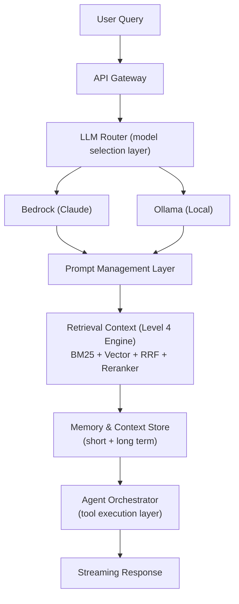

# AI Analytics Copilot – Level 5 - Enterprise AI Orchestration Layer

## 🎯 1. Level 5 Vision

Level 5 transforms the system from:

`Advanced Retrieval-Augmented Generation (RAG) system`

into:

`Enterprise AI Orchestration Platform`

At this stage:

- Retrieval is already solved (Level 3–4)
- Ranking + evaluation is already solved (Level 4)
- Now we focus on:
    - LLM intelligence
    - model routing
    - memory
    - agents
    - streaming
    - multi-provider abstraction

We are no longer building “a chatbot”.

We are building:

`AI Platform = Retrieval Layer + LLM Router + Memory + Tools + Agents`

## 🏗️ 3. High-Level Architecture



## 🔌 4. Model Abstraction Layer (Core of Level 5)

Instead of calling models directly:

**❌ Level 4**

```bash
ollama.generate()
```

**✅ Level 5**

```bash
llm_router.generate()
```

**Interface**
```bash
class LLMProvider:
    def generate(self, prompt: str, **kwargs) -> str:
        pass
```

## Implementations

- BedrockProvider
- OpenAIProvider (optional)
- ClaudeProvider (via Bedrock)
- OllamaProvider (fallback)

## Routing Logic
```bash
if query == "simple":
    use Bedrock Haiku
elif query == "reasoning":
    use Claude Sonnet
elif offline:
    use Ollama
```

## 🧭 5. LLM Router (Intelligence Layer)

The router decides:

- model selection
- token budget
- latency vs quality tradeoff

Example:

```bash
route(query):
    if complexity_score < 0.3:
        return "bedrock-haiku"

    if requires_reasoning:
        return "claude-sonnet"

    return "ollama-qwen"
```

## 🧾 6. Prompt Management System

Centralized prompt registry:

```bash
prompts/
  rag_answer.j2
  agent_planner.j2
  citation_generator.j2
  summarizer.j2
```
Features:
- versioned prompts
- environment switching
- A/B testing
- reusable templates


## 🧠 7. Memory System

**Types of memory**

### Short-term memory
- conversation context window

### Long-term memory

Stored in:
- OpenSearch OR
- DynamoDB OR
- ClickHouse (optional analytics layer)

Stores:

- user preferences
- previous queries
- semantic embeddings of interactions


## 🤖 8. Agentic Workflow Layer

Level 5 introduces controlled agents (NOT full autonomy chaos).

Example flow:
```bash
User Query
   ↓
Planner LLM
   ↓
Retrieve context (Level 4)
   ↓
Call tools (reranker / search / memory)
   ↓
Reasoning LLM
   ↓
Answer Composer
```

## 🌊 9. Streaming Responses

Upgrade API endpoints:
- /chat_stream
- /agent_stream

Behavior:
- token-by-token output
- Bedrock streaming support
- fallback to chunked responses if needed


## 📚 10. Citation-Aware Generation

This is where Level 4 + Level 5 connect.

Every answer must:
- use retrieved context only
- attach sources
- avoid hallucination

Example output:
```json
{
  "answer": "PyTorch is a deep learning framework...",
  "citations": [
    "pytorch/pytorch",
    "tensorflow/tensorflow"
  ]
}
```

## 🔁 11. API Layer (Level 5)

New endpoints:

```bash
POST /chat
POST /chat/stream
POST /agent
POST /memory/query
POST /llm/route
POST /evaluate/llm
```

## ☁️ 12. AWS Bedrock Integration (Core Provider)

Primary production provider:
- Claude 3 (Sonnet / Haiku)
- Titan embeddings (optional upgrade path)
- IAM-based auth (no API keys mess)

## 🧩 13. Key Architectural Shift

| Level   | Focus                                  |
| ------- | -------------------------------------- |
| Level 3 | Hybrid retrieval (BM25 + Vector + RRF) |
| Level 4 | Ranking + evaluation + explainability  |
| Level 5 | LLM orchestration + agents + memory    |


## 🎯 14. Level 5 Success Criteria

Level 5 is complete when:

- Multi-model routing works
- Bedrock integrated successfully
- Prompt system is modular
- Memory persists across sessions
- Streaming responses work
- Agent workflow executes tool chains
- Retrieval (Level 4) is fully reused


## 🚀 15. Non-Goals (Important)

Level 5 does NOT:
- replace retrieval system (Level 4 stays core)
- rebuild indexing or OpenSearch logic
- introduce uncontrolled autonomous agents

## 🔥 Final Summary

Level 5 =

`“Turn your RAG system into a production AI platform with multiple brains (models), memory, and orchestration."`