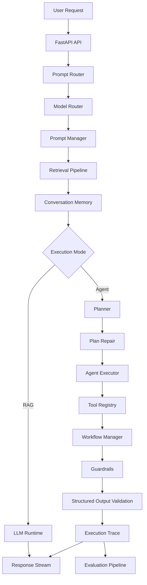
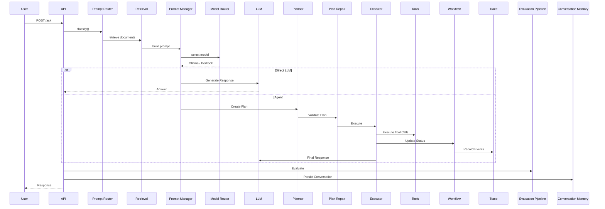

# AI Analytics Copilot – Level 6
# Production Intelligence & Control Layer

---

# 1. Level 6 Vision

Level 6 transforms the AI Analytics Copilot from an intelligent Retrieval-Augmented Generation (RAG) application into a production-ready AI platform capable of controlled reasoning, deterministic execution, observability, evaluation and safe deployment.

Previous levels focused primarily on improving intelligence:

- Level 1 — Keyword + Embedding Ingestion Pipeline
- Level 2 — Keyword (BM25) Retrieval (RAG layer)
- Level 3 — True hybrid RAG pipeline
- Level 4 — Advanced RAG + Ranking Intelligence System
- Level 5 — Memory, agents and orchestration

Level 6 shifts the focus from **building intelligence** to **operating intelligence safely in production**.

The system now introduces production engineering capabilities including:

- Production model routing
- Prompt routing
- Multi-agent orchestration
- Workflow management
- Guardrails
- Structured outputs
- Execution tracing
- Evaluation pipelines
- Production streaming
- Bedrock integration
- Deterministic execution

The objective is no longer simply generating answers, but ensuring every response can be trusted, inspected, reproduced and evaluated.

---

# 2. Design Principles

Level 6 follows several core engineering principles.

## 2.1 Deterministic Execution

Agent execution should always follow an explicit execution plan.

Planning, repair, execution and completion are independent stages rather than allowing autonomous recursive behaviour.

Every decision becomes observable.

---

## 2.2 Production Safety

Every stage of execution is protected by guardrails.

Examples include:

- prompt validation
- tool permission validation
- schema validation
- execution budgets
- output validation

Unsafe execution should fail safely rather than silently.

---

## 2.3 Observability First

Every request should produce sufficient metadata to explain:

- which model answered
- why that model was selected
- what documents were retrieved
- what tools executed
- execution latency
- workflow status
- evaluation metrics

No production request should become a "black box".

---

## 2.4 Explicit Contracts

Components communicate through defined schemas.

Rather than exchanging arbitrary JSON, Level 6 validates:

- tool inputs
- tool outputs
- execution plans
- structured model responses

This greatly reduces runtime ambiguity.

---

## 2.5 Production over Experimentation

Level 6 intentionally reduces agent autonomy.

Instead of allowing unconstrained reasoning loops, execution becomes:

- planned
- validated
- observable
- bounded

This produces predictable production behaviour.

---

# 3. High-Level Architecture



---

The architecture separates the system into independent production layers.

| Layer | Responsibility |
|---------|----------------|
| API | Receives user requests |
| Prompt Router | Determines execution mode |
| Model Router | Selects Ollama or Bedrock |
| Prompt Manager | Builds prompts |
| Retrieval | Hybrid document retrieval |
| Memory | Conversation history |
| Planner | Generates execution plans |
| Plan Repair | Validates execution plans |
| Agent Executor | Executes validated plans |
| Tool Registry | Executes tools |
| Workflow Manager | Tracks workflow state |
| Guardrails | Safety enforcement |
| Structured Output | Schema validation |
| Observability | Execution tracing |
| Evaluation | Offline and online scoring |
| Streaming | SSE response delivery |

---

# 4. Production Request Lifecycle

Every request follows a deterministic execution pipeline.



---

Every production request therefore consists of five logical phases:

1. Request classification
2. Context construction
3. Execution
4. Evaluation
5. Persistence

Unlike previous levels, execution is no longer a direct prompt-response interaction.

---

# 5. Major Components

Level 6 introduces several new production services.

| Component | Purpose |
|------------|----------|
| Prompt Router | Determines execution mode |
| Prompt Manager | Builds prompts |
| Model Router | Selects inference model |
| Planner | Creates execution plans |
| Plan Repair Engine | Repairs unsafe plans |
| Agent Executor | Executes validated plans |
| Workflow Manager | Tracks workflow lifecycle |
| Guardrails | Validates prompts, tools and outputs |
| Structured Output Validator | Enforces schemas |
| Agent Trace | Captures execution events |
| Evaluation Pipeline | Scores execution quality |
| Conversation Memory | Stores session history |

Each component performs a single production responsibility and communicates through explicit interfaces.

---

# 6. Model Routing

Level 6 introduces dynamic model selection.

Rather than always invoking the same language model, the router estimates request complexity and selects the most appropriate inference backend.

Current production configuration:

| Complexity | Runtime |
|------------|----------|
| Low | Ollama (Qwen 2.5) |
| High | AWS Bedrock (Claude 3 Haiku) |

Complexity estimation considers characteristics such as:

- query length
- reasoning keywords
- multiple intents
- architectural questions
- explanatory requests

Example routing:

```
"What time is it?"

↓

Complexity = Low

↓

Ollama
```

```
"Explain distributed systems architecture,
consistency models and CAP theorem"

↓

Complexity = High

↓

AWS Bedrock
```

This hybrid routing strategy minimises inference cost while reserving higher-capability models for complex reasoning tasks.

The routing decision is recorded as part of the execution trace for later evaluation.

---

# 7. Prompt Management

Prompt construction is centralized within the `PromptManager`.

Instead of manually assembling prompts throughout the application, all prompt generation follows a consistent workflow.

The Prompt Router first classifies user intent.

Current prompt types include:

| Prompt Type | Purpose |
|-------------|----------|
| RAG | Retrieval-Augmented Generation |
| CODE | Software development assistance |
| AGENT | Multi-agent execution |
| SUMMARY | Summarisation |

The Prompt Manager then combines:

- system instructions
- user query
- retrieved documents
- conversation history (when enabled)

to produce the final prompt supplied to the selected language model.

This separation provides several benefits:

- prompt reuse
- easier testing
- cleaner orchestration logic
- consistent system instructions
- future prompt versioning

Prompt construction is therefore isolated from retrieval, routing and model execution, allowing each subsystem to evolve independently.

---

# 8. Retrieval Pipeline

The retrieval pipeline is responsible for enriching user queries with structured contextual data before LLM execution.

It operates as part of the orchestration pipeline prior to prompt construction.

## 8.1 Retrieval Flow

Retrieval follows a hybrid strategy:

1. BM25 keyword search (OpenSearch)
2. Vector similarity search (OpenSearch embeddings)
3. Hybrid merging layer
4. Reranking stage (LLM-based or scoring function)

## 8.2 Integration Point

Retrieval is executed inside the orchestration pipeline:

```python
retrieval_raw = self._retrieve(query)
retrieval = self._normalize_retrieval(retrieval_raw)

hybrid = retrieval.get("hybrid_results") or retrieval.get("results") or []
reranked = self.rag.rerank(query, hybrid)
```

## 8.3 Normalization Layer

The system normalizes inconsistent retrieval outputs into a unified schema:

```python
{
  "bm25_results": [],
  "vector_results": [],
  "hybrid_results": []
}
```

## 8.4 Role in Prompt Construction

Reranked results are injected into the PromptManager, ensuring that:

- Only top-ranked documents are used
- Context is limited to top-K (default: 5)
- Retrieval is query-aware before LLM execution

---

# 9. Conversation Memory (ClickHouse)

Level 6 introduces persistent short-term memory using ClickHouse.

## 9.1 Storage Model

Memory is stored per session:

- session_id
- query
- response
- metadata (trace, model, latency, mode)

## 9.2 Write Path

Every successful response is persisted:

```python
self.memory.append(
    session_id,
    query,
    answer,
    metadata={
        "trace": trace,
        "model": model.name,
        "mode": "agent"
    }
)
```

## 9.3 Read Path

Before every request, short-term memory is retrieved:

```python
history = self.memory.get(session_id)
```

Only the last N interactions (default: 5) are used.

## 9.4 Role in System

Memory is used to:

- Provide conversational continuity
- Feed prompt history (optional in prompt builder)
- Support multi-turn reasoning

## 9.5 Design Note

Memory is **not used for long-term semantic retrieval** in Level 6. It is strictly:

> short-term conversational state for session coherence

---

# 10. Multi-Agent Orchestration

Level 6 introduces a controlled multi-agent system.

Unlike autonomous agent frameworks, execution is strictly linear and state-driven.

## 10.1 Execution Flow

```
Planner → Plan Repair → Executor → Tools → Final Answer
```

## 10.2 Orchestrator Entry Point

The system uses:

```python
MultiAgentOrchestrator.run()
```

Which coordinates:

- planning
- validation
- execution
- tracing
- optional critique

## 10.3 Design Constraint

Agents do NOT self-invoke or loop.

All execution is:

- deterministic
- bounded
- traceable

---

# 11. Workflow Manager

The WorkflowManager tracks execution state across the entire agent lifecycle.

## 11.1 Responsibilities

- Create workflow instance per request
- Track current step
- Record completed steps
- Record failed steps
- Maintain final workflow status

## 11.2 Workflow Lifecycle

```text
created → running → completed | completed_with_errors | failed
```

## 11.3 Integration with Executor

Inside `AgentExecutor`:

- `workflow.complete_step(tool)`
- `workflow.fail_step(tool)`
- `workflow.fail_workflow()`

Each tool execution updates workflow state in real time.

---

# 12. Planner

The Planner is responsible for generating structured execution plans.

## 12.1 Input

- user query
- model context

## 12.2 Output

A structured plan object:

```json
{
  "steps": [
    {
      "tool": "get_time",
      "args": {}
    }
  ]
}
```

## 12.3 Role

The planner does NOT execute actions.

It only defines intent as a structured sequence of tool calls.

---

# 13. Plan Repair Engine

The Plan Repair Engine validates and optionally modifies execution plans before execution.

## 13.1 Purpose

Ensures:

- tool validity
- argument correctness
- safe execution ordering
- removal of invalid steps

## 13.2 Behavior

```python
repaired_plan = self.repair.repair(plan, query)
```

## 13.3 Output

- May return identical plan (no changes)
- May remove invalid steps
- May correct malformed arguments

## 13.4 Traceability

Plan repair events are logged in observability traces:

```text
event_type: PLAN_REPAIRED
```

---

# 14. Tool Registry & Tool Execution Layer

The Tool Registry is the execution backend for all agent actions.

## 14.1 Tool Registration

Tools are registered at system initialization:

```python
self.tool_registry.register("get_time", get_time)
self.tool_registry.register("echo", echo_tool)
self.tool_registry.register("search_docs", search_docs_tool)
```

## 14.2 Execution Model

Tools are executed through:

```python
tool(args)
```

wrapped by:

```python
self._execute(tool_name, validated_args)
```

## 14.3 Execution Pipeline

Each tool call passes through:

### 1. Existence Check
```python
if tool_name not in self.tools.list_tools()
```

### 2. Permission Check
```python
self.guardrails.validate_tool_permission(tool_name)
```

### 3. Input Validation
```python
self.guardrails.validate_tool_input(tool_name, args)
```

### 4. Schema Validation (if defined)
```python
input_model(**args).model_dump()
```

### 5. Execution
```python
tool(args)
```

### 6. Output Validation
```python
output_model(**output).model_dump()
```

## 14.4 Tool Execution Budget

A strict limit prevents infinite tool loops:

```python
max_tool_calls = 10
```

Execution stops when threshold is exceeded.

## 14.5 Failure Handling

Failures are captured at multiple levels:

- invalid tool
- permission denied
- input validation failure
- schema validation failure
- execution error

All failures are recorded in the `AgentTrace`.

---

# 15. Structured Outputs

Level 6 introduces structured output enforcement as a production safety layer for both tools and model responses.

Unlike earlier levels where LLM outputs were treated as free-form text, Level 6 enforces schema validation at multiple stages.

---

## 15.1 Design Goal

Ensure all critical system outputs conform to predictable structures:

- Tool inputs
- Tool outputs
- Planner outputs
- Final answers (where applicable)

This prevents malformed JSON, inconsistent tool usage, and downstream execution errors.

---

## 15.2 Tool-Level Structured Output Validation

Each tool can optionally define:

- input schema
- output schema

During execution:

```python
input_model = self.tools.get_input_model(tool_name)
output_model = self.tools.get_output_model(tool_name)
```

Validation flow:

### Input Validation
```python
validated_args = input_model(**args).model_dump()
```

### Output Validation
```python
output = output_model(**output).model_dump()
```

---

## 15.3 Failure Handling

If schema validation fails:

- Execution is stopped
- A `SCHEMA_VALIDATION_FAILED` event is recorded
- Workflow is marked as failed or partially failed

This is captured in the execution trace for evaluation and debugging.

---

## 15.4 Structured Output Role in Level 6

Structured outputs serve as:

- contract between LLM and tools
- safety boundary for execution
- evaluation signal for correctness

---

# 16. Guardrails System

Guardrails are enforced at **three layers of execution**.

---

## 16.1 Input Guardrails

Applied before any model execution:

- prompt injection detection
- malicious input filtering
- unsafe instruction detection

```python
self.guardrails.validate_prompt(query)
```

If validation fails:

- request is blocked
- no model is called
- trace records guardrail rejection

---

## 16.2 Tool Guardrails

Applied before tool execution:

### Permission Control
```python
self.guardrails.validate_tool_permission(tool_name)
```

### Input Validation
```python
self.guardrails.validate_tool_input(tool_name, args)
```

### Execution Budget

Hard limit on tool execution:

```python
max_tool_calls = 10
```

Prevents:

- infinite loops
- runaway agent execution
- recursive tool abuse

---

## 16.3 Output Guardrails

Applied after tool execution:

- output sanitization
- basic safety filtering
- structural normalization

```python
output = self.guardrails.validate_tool_output(tool_name, output)
```

---

## 16.4 Guardrail Philosophy

Guardrails in Level 6 are not advisory.

They are:

> hard execution boundaries

---

# 17. Observability & Execution Tracing

Level 6 implements full execution tracing via `AgentTrace` and `StepTrace`.

---

## 17.1 Trace Model

Every request generates a trace containing:

- step-by-step execution
- tool usage
- model routing decisions
- workflow transitions
- failures

---

## 17.2 Step Trace Events

Supported event types:

- `PLAN`
- `PLAN_REPAIRED`
- `TOOL_EXECUTION`
- `TOOL_FAILED`
- `SCHEMA_VALIDATION_FAILED`
- `FINAL_ANSWER`

---

## 17.3 Example Trace

```json
{
  "trace_id": "1fea7703-dcde-48bc-81fe-14a45a82e82e",
  "query": "what time is it",
  "steps": [
    {
      "tool": "planner_agent",
      "event_type": "plan"
    },
    {
      "tool": "repair_agent",
      "event_type": "plan_repaired"
    },
    {
      "tool": "get_time",
      "event_type": "tool_execution"
    },
    {
      "tool": "final_answer",
      "event_type": "final_answer"
    }
  ]
}
```

---

## 17.4 Workflow Observability

Each execution is tracked via `WorkflowManager`:

```json
{
  "workflow_id": "abc",
  "status": "completed",
  "completed_steps": ["get_time"],
  "failed_steps": []
}
```

---

## 17.5 Observability Goals

- full reproducibility
- debugging capability
- evaluation scoring
- production monitoring

---

# 18. Evaluation Pipeline

Level 6 introduces a deterministic evaluation system via `/evaluate`.

---

## 18.1 Purpose

To measure:

- correctness of tool execution
- plan alignment
- ordering accuracy
- coverage of expected steps
- system determinism

---

## 18.2 Evaluation Input

```json
{
  "dataset": [
    {
      "id": "repair-test",
      "query": "what time is it",
      "expected_steps": [
        {
          "tool": "get_time",
          "args": {}
        }
      ]
    }
  ]
}
```

---

## 18.3 Evaluation Metrics

Each evaluation produces:

- alignment score
- coverage score
- ordering score
- penalty score
- final score

---

## 18.4 Replay Engine

Evaluation includes deterministic replay validation:

- same execution path
- same tool ordering
- same workflow transitions

```json
"replay": {
  "deterministic": true,
  "trace_match": true
}
```

---

## 18.5 Evaluation Output

```json
{
  "summary": {
    "total": 1,
    "passed": 1,
    "score": 1.0
  }
}
```

---

## 18.6 Importance in Level 6

This is the foundation for:

- regression testing
- model upgrades
- prompt tuning validation
- system reliability metrics

---

# 19. Streaming Architecture (SSE)

Level 6 supports real-time token streaming using Server-Sent Events (SSE).

---

## 19.1 Streaming Flow

Streaming is handled at the orchestration pipeline level:

```python
for token in model.stream(prompt=context):
    yield f"data: {json.dumps({'token': token})}\n\n"
```

---

## 19.2 Stream Contract

Each streamed message:

```json
{
  "token": "partial text"
}
```

Final message:

```json
{
  "token": "[DONE]"
}
```

---

## 19.3 Memory Integration

Streaming responses are accumulated:

```python
full_response += token
```

Then persisted:

```python
self.memory.append(session_id, query, full_response)
```

---

## 19.4 Design Constraint

Streaming is:

- stateless per token
- stateful per request
- decoupled from model provider

---

# 20. Bedrock Production Runtime

Level 6 integrates AWS Bedrock as the production-grade LLM backend.

---

## 20.1 Model Strategy

Two-tier runtime:

| Mode | Model |
|------|------|
| Low complexity | Ollama (local Qwen 2.5) |
| High complexity | AWS Bedrock (Claude 3 Haiku) |

---

## 20.2 Authentication

Uses IAM-based authentication via:

```python
boto3.client("bedrock-runtime")
```

Credentials are injected via:

- AWS CLI profile OR
- container-mounted ~/.aws directory

---

## 20.3 Bedrock Client

Supports:

### Standard generation
```python
invoke_model()
```

### Streaming
```python
invoke_model_with_response_stream()
```

---

## 20.4 Model Output Format

Bedrock responses are normalized:

```python
payload.get("content")[0].get("text")
```

---

## 20.5 Fallback Strategy

If Bedrock is unavailable:

- system falls back to Ollama (dev mode only)
- no request failure propagation (graceful degradation)

---

## 20.6 Production Role

Bedrock is used for:

- high reasoning complexity queries
- multi-step reasoning
- architecture questions
- long-form generation

---

# LEVEL 6 – DESIGN DOCUMENT (PART 4)
## Production Hardening, Reliability & Roadmap

---

## 21. Error Handling Strategy (Production Grade)

Level 6 introduces **layered failure handling** across the full orchestration stack.

### 21.1 Failure Domains

Errors are classified into:

- **Prompt-level failures**
  - Guardrail rejection (input blocked)
- **Routing failures**
  - Model selection issues (Ollama/Bedrock fallback)
- **Retrieval failures**
  - Empty or malformed retrieval results
- **Agent execution failures**
  - Tool errors, invalid tool calls
- **Schema failures**
  - Structured output validation errors
- **Workflow failures**
  - Step failure or incomplete execution

---

### 21.2 Execution-Time Handling

Inside `AgentExecutor.run_plan()`:

- Invalid tools → immediate skip + trace
- Permission denial → guardrail failure event
- Input validation failure → tool blocked
- Schema validation failure → execution continues safely
- Tool execution failure → captured but does not crash pipeline

Each failure produces:

```json
{
  "step": 3,
  "tool": "search_docs",
  "event_type": "tool_failed",
  "reason": "Permission denied"
}

## 21.3 Pipeline-Level Resilience

In `OrchestrationPipeline.run()`:

- Guardrail rejection returns early structured response  
- Missing model outputs are replaced with fallback text  
- Agent mode failures do not break retrieval pipeline  
- Memory writes are isolated from execution success  

---

## 22. System Constraints (Hard Production Rules)

Level 6 enforces strict execution constraints:

### 22.1 Tool Execution Constraints

- Maximum tool calls enforced via `Guardrails.max_tool_calls`  
- Hard stop when exceeded  
- No recursive tool loops allowed  

---

### 22.2 Prompt Safety Constraints

- Prompt injection detection applied before routing  
- Unsafe queries are blocked before LLM invocation  

---

### 22.3 Execution Determinism Constraints

- All agent runs must produce a deterministic trace  
- No hidden tool execution outside orchestrator  
- No silent failures allowed (every failure is traced)  

---

### 22.4 Memory Constraints

- Only last N messages used for context (`limit=5`)  
- ClickHouse used as persistent short-term memory layer  
- Memory append is asynchronous-safe (non-blocking design assumption)  

---

## 23. Success Criteria (Level 6 Completion Definition)

Level 6 is considered successful when:

---

### 23.1 Observability Completeness

Every request includes:

- Full execution trace (`AgentTrace`)  
- Step-level tool logs (`StepTrace`)  
- Model selection metadata  
- Retrieval metadata (BM25 / vector / hybrid counts)  

---

### 23.2 Evaluation Readiness

System supports:

- Offline evaluation datasets  
- Tool-level correctness scoring  
- Retrieval quality scoring hooks  
- Trace replay capability  

---

### 23.3 Structured Output Compliance

- All agent outputs validated through schema layer  
- Invalid outputs are rejected or corrected  
- Final responses follow strict format contract  

---

### 23.4 Guardrail Enforcement

- Input blocking works reliably  
- Tool permission system enforced  
- Execution limits respected  
- Output sanitization applied  

---

### 23.5 Production LLM Routing

- Bedrock used for high-complexity reasoning  
- Ollama used for low-latency responses  
- Routing decisions logged for every request  

---

## 24. Current Limitations (Known Gaps in Level 6)

Despite full Level 6 implementation, limitations remain:

---

### 24.1 Retrieval Quality

- No learning-to-rank model  
- Reranking is heuristic-based  
- Context injection is still static  

---

### 24.2 Memory System

- No long-term semantic memory (only short-term ClickHouse)  
- No summarization-based memory compression  
- No retrieval-augmented memory search  

---

### 24.3 Evaluation Pipeline

- Evaluation exists conceptually but is not fully automated in CI/CD  
- No continuous feedback loop into model routing  

---

### 24.4 Multi-Agent System

- Planner → Repair → Executor is deterministic but not adaptive  
- No dynamic agent spawning  
- No reinforcement learning loop  

---

### 24.5 Observability

Trace is complete but not yet:

- Centralized in observability backend  
- Indexed for analytics dashboards  
- Connected to alerting systems  

---

## 25. Level 7 Roadmap (Next Evolution Stage)

Level 7 evolves the system into a **self-improving AI execution platform**.

---

### 25.1 Adaptive Intelligence Layer

- Dynamic routing based on historical success rates  
- Learned model selection policies  
- Context-aware tool selection  

---

### 25.2 Continuous Evaluation Loop

- Online evaluation of every production request  
- Automatic regression detection  
- Dataset generation from production traces  

---

### 25.3 Memory Evolution (Long-Term Intelligence)

- Semantic memory store (vector + structured hybrid)  
- Conversation summarization engine  
- Cross-session reasoning memory  

---

### 25.4 Autonomous Agent Expansion

- Dynamic tool discovery  
- Self-updating tool registry  
- Multi-agent negotiation layer  

---

### 25.5 Observability & MLOps Integration

- Full trace streaming to observability backend  
- Dashboards for:
  - latency  
  - tool failure rate  
  - model performance  
- Alerting on:
  - hallucination spikes  
  - tool failure anomalies  

---

### 25.6 Production Hardening

- Blue/green model deployment for Bedrock routing  
- A/B testing between Ollama and Bedrock  
- Cost-aware routing layer  

---

## Summary

Level 6 establishes:

> A controlled, observable, and production-safe agentic system.

Level 7 moves toward:

> A self-improving AI system with continuous learning and adaptive behavior.