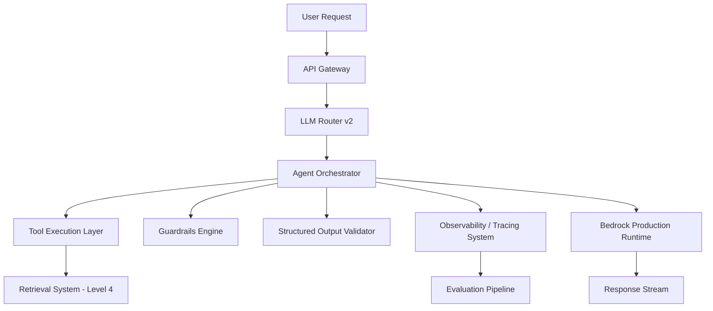

# AI Analytics Copilot – Level 6: Production Intelligence & Control Layer

---

## 🎯 1. Level 6 Vision

Level 6 is where the system transitions from:

`Agentic orchestration platform`

into:

`Production-grade, controlled, observable AI system`

At this stage we stop adding “more intelligence” and start adding:

- Control
- Safety
- Observability
- Evaluation discipline
- Production readiness

We assume Level 3–5 are already stable:
- Retrieval (Level 3–4)
- LLM routing + agents + memory (Level 5)

Now we industrialize the system.

---

## 🧠 2. Core Philosophy of Level 6

Level 6 is about:

> “You can trust what the system did, why it did it, and whether it was correct.”

We introduce:

- Deterministic observability
- Evaluation pipelines
- Guardrails everywhere
- Structured outputs as a contract
- Production deployment discipline
- Controlled multi-agent execution

---

## 🏗️ 3. High-Level Architecture




# Level 6 — Production Hardening

## 4. Key System Upgrade Areas

Level 6 introduces 6 foundational upgrades:

- Evaluation pipelines
- Observability layer
- Guardrails system
- Structured outputs contract
- Production Bedrock deployment
- Multi-agent execution (controlled)

---

## 📊 5. Evaluation Pipelines

Every response can be evaluated.

**Types of evaluation:**

- Retrieval quality
- Tool correctness
- Reasoning correctness
- Latency scoring
- Hallucination detection

**Evaluation outputs:**

```json
{
  "query": "...",
  "score": 0.87,
  "failure_modes": ["tool_misuse"],
  "retrieval_quality": 0.91,
  "reasoning_quality": 0.84
}
```

**Goal:** Continuous offline + online evaluation of system behavior.

---

## 🧾 6. Agent Observability (Full Execution Tracing)

Every agent run produces a trace.

**Trace includes:**

- Prompt inputs
- Tool calls
- Tool outputs
- Model decisions
- Routing decisions
- Final answer path

**Example:**

```json
{
  "trace_id": "abc123",
  "steps": [
    { "action": "route_model", "value": "claude-sonnet" },
    { "action": "tool_call", "tool": "search_docs" },
    { "action": "tool_result", "status": "success" },
    { "action": "final_answer" }
  ]
}
```

**Goal:** Full reproducibility of any answer.

---

## 🛡️ 7. Guardrails System

Guardrails operate at 3 layers:

**1. Input Guardrails**
- Prompt injection detection
- Malicious query filtering

**2. Tool Guardrails**
- Tool permission control
- Argument validation
- Execution limits

**3. Output Guardrails**
- Hallucination detection
- Schema enforcement
- Safety filtering

---

## 📐 8. Structured Outputs (System-wide Contract)

All model outputs must follow schemas.

**Example schema:**

```json
{
  "answer": "string",
  "citations": ["string"],
  "confidence": "float",
  "tools_used": ["string"]
}
```

**Enforcement layers:**

- LLM prompt constraints
- Post-generation validation
- Retry if invalid

**Goal:** No more free-form unreliable outputs.

---

## ☁️ 9. Production Bedrock Deployment

Level 6 formalizes AWS Bedrock as the primary production runtime.

**Models:**

- Claude Sonnet — reasoning
- Claude Haiku — fast responses

**Requirements:**

- IAM-based auth
- No local fallback in prod path (optional dev only)
- Streaming support enabled
- Latency tracking

---

## 🤖 10. Controlled Multi-Agent Workflows

Multi-agent system is now **controlled orchestration**, not autonomous chaos.

**Pattern:**

```
Planner Agent
     ↓
 Tool Agent
     ↓
Retriever Agent
     ↓
Verifier Agent
     ↓
Final Composer
```

**Rules:**

- Max depth enforced
- No recursive loops
- Strict handoff contracts

---

## 📦 11. System Constraints (Hard Rules)

Level 6 enforces:

- No uncontrolled tool loops
- No unvalidated outputs
- No silent failures
- No missing traces
- No schema-less responses

---

## 📈 12. Success Criteria

Level 6 is complete when:

- Every request has a full execution trace
- Every output passes schema validation
- Evaluation scores are generated automatically
- Guardrails block unsafe actions reliably
- Bedrock is production stable
- Multi-agent flows are deterministic

---

## 🚫 13. Non-Goals

Level 6 does **not**:

- Introduce new retrieval methods
- Redesign the LLM router completely
- Expand agent autonomy further
- Add new data infrastructure layers

---

## 🧩 14. Summary

> **Level 6 = "Make the system safe, observable, testable, and production-grade."**

We move from **building intelligence** to **controlling intelligence**.