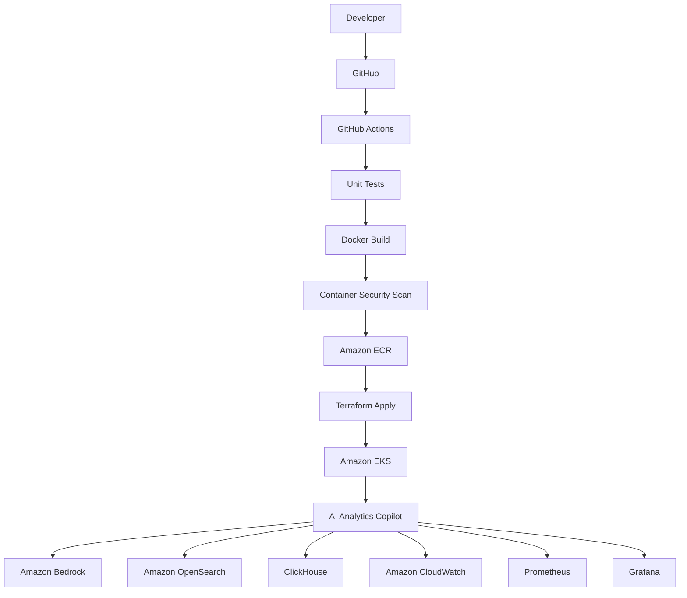

# AI Analytics Copilot – Level 7
# Cloud-Native AWS Platform

---

# 1. Vision

Level 7 transforms the AI Analytics Copilot from:

```text
Production-ready Local AI Platform
```

into:

```text
Fully Cloud-Native Enterprise AI Platform
```

Unlike previous levels, Level 7 introduces **no new AI capabilities**.

Instead, the focus shifts entirely toward cloud infrastructure, scalability, deployment automation, security, operational excellence, and production readiness on AWS.

By the completion of Level 7, Docker Compose remains exclusively a local development environment, while Amazon EKS becomes the primary production deployment platform.

---

# 2. Level 7 Objectives

Level 7 introduces five major architectural transformations:

- Cloud-native deployment
- Infrastructure as Code
- Kubernetes orchestration
- Automated CI/CD
- Enterprise operations

The AI capabilities implemented in Levels 1–6 remain unchanged.

---

# 3. High-Level Architecture



---

# 4. Architectural Principles

Level 7 follows several cloud-native principles.

## Infrastructure as Code

Every AWS resource is provisioned using Terraform.

Infrastructure becomes:

- repeatable
- version controlled
- reviewable
- auditable

---

## Immutable Infrastructure

Containers are never modified after deployment.

Every release creates new images.

Old versions are replaced through rolling deployments.

---

## GitOps Deployment

GitHub becomes the single source of truth.

Every infrastructure or application change originates from Git.

Deployments become fully reproducible.

---

## Kubernetes First

Every service runs inside Kubernetes.

No production workloads execute directly on EC2.

---

## Cloud Native

Applications become stateless wherever possible.

Persistent storage is externalised using managed services or Kubernetes volumes.

---

# 5. Amazon EKS Platform

Amazon EKS becomes the production runtime.

The Kubernetes cluster hosts:

```text
Orchestrator API

Retrieval Service

Evaluation Service

Reranking Service

Prompt Management

Memory Service

Observability Components

NGINX Ingress Controller
```

Development clusters may additionally include:

```text
Ollama Runtime
```

Production clusters primarily utilise AWS Bedrock.

Deployment goals include:

- High availability
- Rolling updates
- Self-healing
- Horizontal scaling
- Zero-downtime deployments

---

# 6. Infrastructure as Code (Terraform)

Terraform provisions the complete AWS platform.

Infrastructure includes:

```text
Amazon VPC

Public Subnets

Private Subnets

Internet Gateway

NAT Gateways

Route Tables

Security Groups

IAM Roles

IAM Policies

IRSA

Amazon EKS

Amazon ECR

Amazon Route53

AWS Certificate Manager

Application Load Balancer

CloudWatch

Amazon EFS
```

Terraform modules are organised into reusable components:

```text
terraform/

modules/

network/

eks/

iam/

ecr/

alb/

efs/

cloudwatch/

platform/
```

Benefits include:

- reusable modules

- environment consistency

- automated provisioning

- simplified operations

---

# 7. GitHub Actions CI/CD

GitHub Actions becomes the orchestration engine for the complete delivery pipeline.

Pipeline flow:

```text
Developer Push
        │
        ▼
GitHub Actions
        │
        ▼
Lint
        │
        ▼
Unit Tests
        │
        ▼
Docker Build
        │
        ▼
Security Scan
        │
        ▼
Push Images to Amazon ECR
        │
        ▼
Terraform Plan
        │
        ▼
Terraform Apply
        │
        ▼
Helm Deployment
        │
        ▼
Integration Tests
        │
        ▼
Evaluation Pipeline
        │
        ▼
Production
```

Deployment capabilities include:

- automated builds

- infrastructure provisioning

- rolling upgrades

- canary deployments

- blue/green deployment

- rollback support

---

# 8. Helm-Based Kubernetes Deployments

Application deployment is managed using Helm.

Each component receives an independent Helm chart.

Example structure:

```text
helm/

orchestrator/

retrieval/

evaluation/

clickhouse/

opensearch/

ingress/

observability/
```

Benefits:

- versioned deployments

- reusable templates

- environment-specific values

- simplified upgrades

---

# 9. Container Registry (Amazon ECR)

All production container images are stored in Amazon ECR.

Image lifecycle:

```text
Build

↓

Security Scan

↓

Version Tag

↓

Amazon ECR

↓

Amazon EKS
```

Benefits:

- centralised image management

- vulnerability scanning

- immutable versioning

- private registry

---

# 10. Cloud Storage Services

Local infrastructure is progressively replaced with AWS services.

Current architecture:

```text
ClickHouse (Kubernetes)

OpenSearch

Amazon EFS

Amazon S3

Amazon ECR
```

Future migration options remain open without changing application code.

---

# 11. Security Architecture

Enterprise security becomes mandatory.

Security controls include:

- IAM Roles for Service Accounts (IRSA)

- Kubernetes RBAC

- Network Policies

- Pod Security Standards

- AWS Secrets Manager

- Parameter Store

- TLS Everywhere

- Encryption at Rest

- Encryption in Transit

No application contains long-lived AWS credentials.

---

# 12. Observability Platform

The Level 6 tracing framework expands into a cloud-native observability platform.

Integrated services include:

```text
Amazon CloudWatch

CloudWatch Logs

CloudWatch Metrics

Prometheus

Grafana
```

Dashboards include:

- request latency

- retrieval latency

- model routing

- tool execution

- Kubernetes utilisation

- pod health

- evaluation scores

- API throughput

---

# 13. Autoscaling

Level 7 introduces elastic scaling.

Implemented components include:

- Horizontal Pod Autoscaler

- Cluster Autoscaler

- Managed Node Groups

- Resource Requests

- Resource Limits

- Pod Disruption Budgets

Objectives:

- elastic capacity

- cost optimisation

- resilience

---

# 14. Production Operations

Operational capabilities include:

- readiness probes

- liveness probes

- graceful shutdown

- rolling upgrades

- backup strategy

- disaster recovery

- multi-AZ deployment

- automated health monitoring

---

# 15. Success Criteria

Level 7 is complete when:

| Requirement | Status |
|-------------|--------|
| Terraform provisions AWS infrastructure | ✅ |
| GitHub Actions automates CI/CD | ✅ |
| Helm deploys Kubernetes workloads | ✅ |
| Amazon EKS hosts production services | ✅ |
| Amazon ECR stores container images | ✅ |
| CloudWatch monitors workloads | ✅ |
| Platform scales automatically | ✅ |
| Enterprise security implemented | ✅ |
| Docker Compose retained for local development | ✅ |

---

# 16. Architectural Shift

| Level | Focus |
|--------|-------|
| Level 1 | Embedding & Data Ingestion |
| Level 2 | BM25 Retrieval |
| Level 3 | Hybrid RAG |
| Level 4 | Advanced RAG + Ranking Intelligence |
| Level 5 | Memory, Agents & Orchestration |
| Level 6 | Production Intelligence & Control |
| **Level 7** | **Cloud-Native AWS Platform** |

---

# 17. Final Outcome

Level 7 successfully transforms the AI Analytics Copilot from:

```text
Production AI Platform
```

into:

```text
Cloud-Native Enterprise AI Platform
```

running entirely on AWS with:

- Amazon EKS
- Terraform
- GitHub Actions
- Helm
- Amazon ECR
- CloudWatch
- Prometheus
- Grafana
- Enterprise security
- High availability
- Horizontal scalability
- Production-grade operations

Docker Compose remains the local developer environment, while Amazon EKS becomes the production deployment platform.
