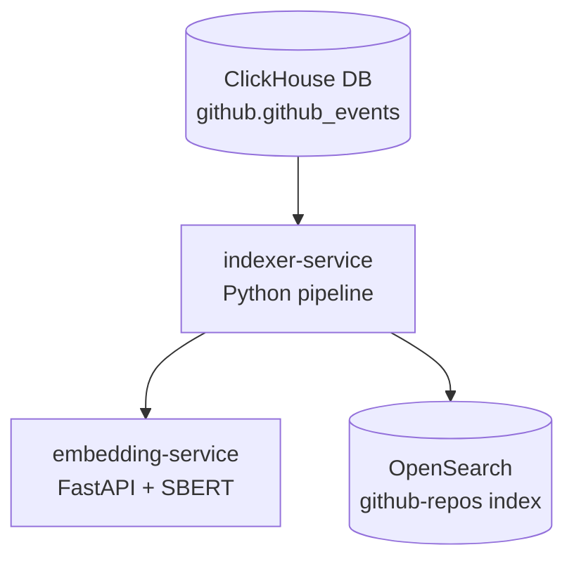
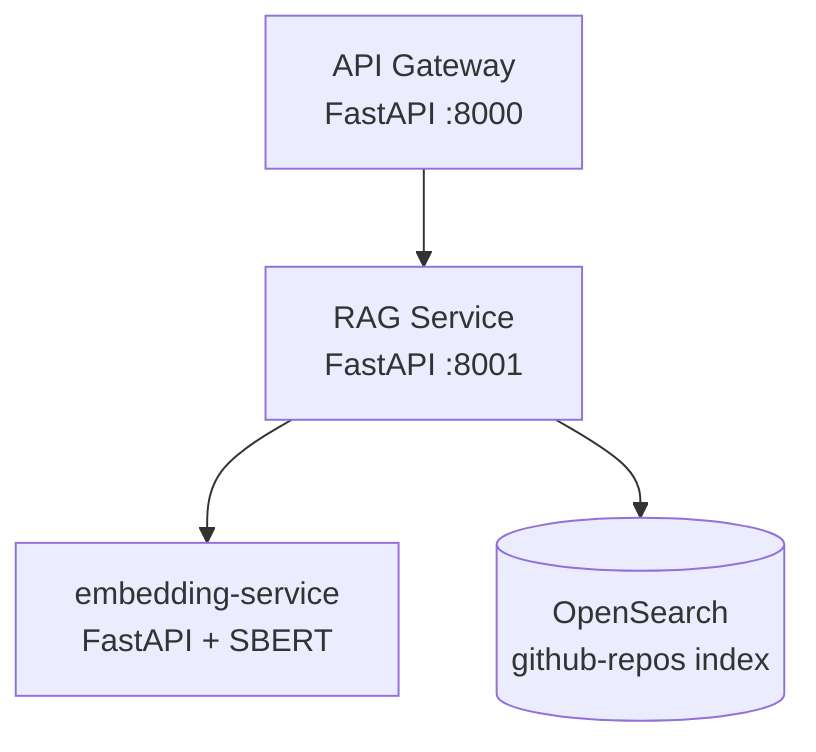

# AI Analytics Copilot — Level 1 (Keyword + Embedding Ingestion Pipeline)

## Overview

This is Level 1 of the AI Analytics Copilot system.

It implements a full data ingestion pipeline:

ClickHouse → Indexer Service → Embedding Service → OpenSearch

The system extracts GitHub repository data, generates embeddings, and indexes documents into OpenSearch for keyword-based search.

---

## 🧱 Architecture

ClickHouse → source of GitHub repo data
Embedding Service (FastAPI + sentence-transformers)
Indexer Service (ClickHouse → Embeddings → OpenSearch)
OpenSearch → vector + keyword search storage
API Gateway → entry point (FastAPI)
RAG Service → query layer

1. Offline / Ingestion Layer (your current diagram)


✔ This is perfect for Level 1 “data pipeline”

2. Online / Query Layer (add this separately)



✔ This represents:

- user queries
- embedding search
- retrieval from OpenSearch


## ⚙️ Services

| Service           | URL                                              |
| ----------------- | ------------------------------------------------ |
| API Gateway       | [http://localhost:8000](http://localhost:8000)   |
| Embedding Service | [http://localhost:8002](http://localhost:8002)   |
| ClickHouse        | [http://localhost:8123](http://localhost:8123)   |
| OpenSearch        | [https://localhost:9200](https://localhost:9200) |


### 1. ClickHouse
- Stores GitHub repository metadata
- Source of truth for ingestion

### 2. Indexer Service
- Reads data from ClickHouse
- Calls embedding service
- Indexes documents into OpenSearch

### 3. Embedding Service
- FastAPI service
- Uses `sentence-transformers`
- Endpoint:


POST /embed


### 4. OpenSearch
- Stores documents + embeddings
- Used for keyword search (BM25)

---

## 🚀 How to Run

### 1. Start all services

```bash
make up
```

2. Verify services

```bash
docker-compose ps
```

Expected:

embedding-service → Up
indexer-service → Exited 0 (batch job)
clickhouse → healthy
opensearch → healthy

```bash
curl http://localhost:8002/health
curl http://localhost:8000/health
```


3. Run ingestion manually (if needed)

```bash
docker-compose run indexer-service
```

Test Embedding Service

```bash
curl http://localhost:8002/health

```bash
curl -X POST http://localhost:8002/embed \
-H "Content-Type: application/json" \
-d '{"text": "hello world"}'
```

Test OpenSearch

```bash
curl -k -u "admin:Opensearch2026!Aa" \
"https://localhost:9200/_cat/indices?v"

```
Test Search
```bash
curl -k -u "admin:Opensearch2026!Aa" \
"https://localhost:9200/github-repos/_search" \
-H "Content-Type: application/json" \
-d '{
  "size": 3,
  "query": {
    "match": {
      "description": "machine learning"
    }
  }
}'
```

Environment Variables

Indexer Service

```bash
CLICKHOUSE_HOST=clickhouse
CLICKHOUSE_USER=admin
CLICKHOUSE_PASSWORD=admin123
```

Embedding Service

```bash
RUN_ONCE=true
```
⚠️ Known behavior (Level 1)
- Indexer is batch-run (not streaming)
- Embedding service is CPU-based (slow but stable)
- OpenSearch security warnings ignored in dev
- ClickHouse must be healthy before indexer starts

🎯 Success criteria
- Embedding service responds
- Indexer successfully processes rows
- OpenSearch index github-repos contains embeddings

⚠️ Known Limitations (Level 1)
- Uses BM25 keyword search (no vector search yet)
- No semantic similarity (embeddings stored but not queried)
- Single-node OpenSearch (yellow indices expected)
- No async batching in indexer


🎯 What Level 1 Achieves

✔ Distributed microservice ingestion pipeline
✔ Embedding generation service
✔ OpenSearch indexing
✔ ClickHouse integration
✔ End-to-end data flow validated


🚀 Next Step: Level 2

Level 2 will introduce:

- kNN vector search in OpenSearch
- semantic retrieval using embeddings
- query embedding pipeline
- RAG-ready architecture