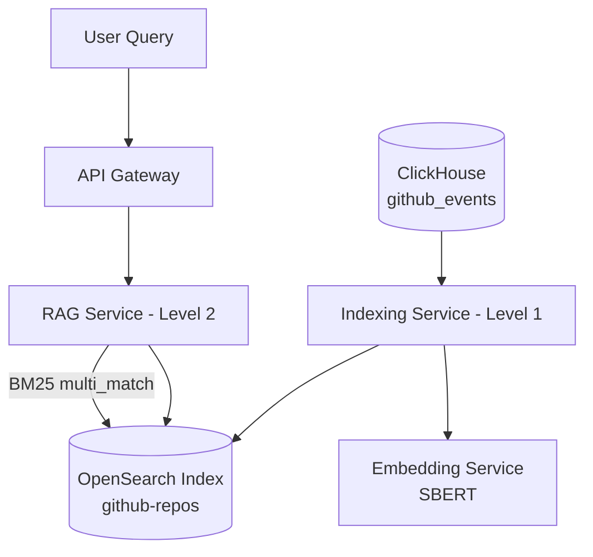
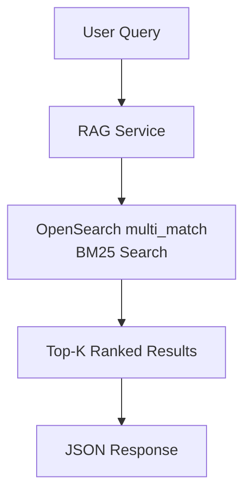

# 🚀 AI Analytics Copilot — Level 2

Level 2 introduces a **keyword-based retrieval system** built on top of OpenSearch using BM25 full-text search. This stage focuses on building a scalable and production-style search pipeline over GitHub repository metadata.

---

## 🎯 What Level 2 adds

Level 2 extends Level 1 by introducing:

- 🔍 OpenSearch BM25 full-text search (`multi_match`)
- ⚡ Real-time query API for repository search
- 📦 Structured ingestion pipeline (ClickHouse → OpenSearch)
- 🧠 Embedding generation during ingestion (stored for future use)
- 🧩 Separation of ingestion and retrieval concerns

---

## 🧱 System Architecture



## 🔄 Search Flow (Level 2)



## 🔧 Services Overview

🔹 ClickHouse
   - Stores raw GitHub event/repository data
   - Source of truth for ingestion pipeline

🔹 indexer-service (Level 1 component)
   - Batch ingestion pipeline
   - Reads data from ClickHouse
   - Generates embeddings (SBERT via embedding-service)
   - Stores documents in OpenSearch
   - Runs offline only (NOT part of query flow)

🔹 embedding-service
   - FastAPI service
   - Input: text
   - Output: dense embedding vector (SBERT)
   - Stateless service
   - Used only during ingestion (not retrieval in Level 2)
    
🔹 OpenSearch
   - Stores repository documents
   - Index: github-repos
   - Provides BM25 full-text search via multi_match
   - Fields searched:
      - repo_name
      - description
      - language

🔹 RAG-service (Level 2 core)
   - Exposes /search endpoint
   - Accepts user query
   - Executes BM25 search using OpenSearch
   - Returns top-K ranked repositories

## 📡  API Endpoints

🔹 POST /search

Search GitHub repositories using keyword-based retrieval.

```json
{
  "query": "deep learning frameworks"
}
```

Response:

```json
{
  "query": "deep learning frameworks",
  "results": [
    {
      "repo_name": "tensorflow/tensorflow",
      "description": "Deep learning framework",
      "score": 0.056
    }
  ]
}
```

🔹 GET /health

```json
{
  "status": "ok"
}
```

## 🔎 Search Logic (Core of Level 2)

```json
{
  "size": 5,
  "query": {
    "multi_match": {
      "query": "user input",
      "fields": [
        "description",
        "repo_name",
        "language"
      ]
    }
  }
}
```

## 🧪 How to Run (Level 2)

### 1. Start all services

```bash
make up
```

### 2. Verify services are running

```bash
docker-compose ps
```

Expected services:
- clickhouse
- opensearch
- embedding-service
- indexer-service
- rag-service
- api-gateway

### 3. Run ingestion (Level 1 pipeline)

If not already executed automatically:
```bash
docker-compose run --rm indexer-service
```

This will:

- read from ClickHouse
- generate embeddings
- index into OpenSearch

### 4. Test OpenSearch data

```bash
curl -k -u admin:Opensearch2026\!Aa \
"https://localhost:9200/github-repos/_search" \
-H "Content-Type: application/json" \
-d '{
  "size": 3,
  "query": {
    "match_all": {}
  }
}'
```

### 5. Test RAG search API

```bash
curl -X POST http://localhost:8001/search \
  -H "Content-Type: application/json" \
  -d '{"query": "machine learning"}'
```

## 🧱 Key Design Principle

Level 2 is a lexical retrieval system, not a semantic system.

- ❌ No k-NN vector search
- ❌ No semantic similarity search
- ❌ No LLM-based reasoning
- ✅ BM25 keyword search via OpenSearch
- ✅ Deterministic ranking
- ✅ Fast and explainable retrieval

## 🚀 What’s next (Level 3 preview)

Level 3 will introduce:

- hybrid search (BM25 + embeddings)
- vector k-NN in OpenSearch
- semantic ranking layer
- true RAG pipeline with LLM response generation

## 🏁 Summary

Level 2 establishes a production-style search engine over GitHub metadata using OpenSearch BM25, forming the foundation for future semantic RAG capabilities.