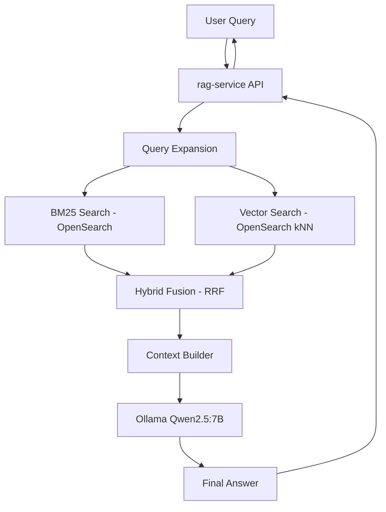

# 🚀 AI Analytics Copilot - Level 3 Hybrid RAG + Local LLM (Ollama)

Level 3 upgrades the AI Analytics Copilot into a full Retrieval-Augmented Generation (RAG) system with:

- BM25 lexical search (OpenSearch)
- Vector similarity search (OpenSearch k-NN)
- Hybrid ranking (RRF fusion)
- Query expansion (light semantic boost)
- Local LLM inference via Ollama (Qwen2.5:7B)
- Retrieval-aware response generation

---

## 🧱 Architecture Overview



## 🔍 Retrieval Pipeline

### 1. BM25 Search
Uses OpenSearch multi_match:
- repo_name
- description
- language

### 2. Vector Search
Uses embedding similarity via OpenSearch k-NN index.

### 3. Hybrid Fusion
Reciprocal Rank Fusion (RRF):
- Combines BM25 + vector rankings
- Produces stable relevance ordering


## LLM Layer
- Model: Qwen2.5:7B (Ollama)
- Runs locally via Docker container
- Stateless inference via /api/generate

Prompt format:
```json
Context:
{retrieved repositories}

Question:
{user query}
```

## 📡 API Endpoints

### 🔹 Health
```bash
GET /health
```

### 🔹 BM25 Search
```bash
POST /search
```

### 🔹 Vector Search
```bash
POST /vector-search
```

### 🔹 Full RAG (Hybrid + LLM)
```bash
POST /ask
```
Response:
```json
{
  "query": "...",
  "retrieval": {
    "method": "hybrid",
    "documents_retrieved": 2
  },
  "answer": "...",
  "sources": [...]
}
```

### 🔹 Debug Retrieval (Dev Tool)
```bash
POST /debug-retrieval
```

Returns:
- expanded query
- BM25 results
- vector results
- fused ranking

## ⚙️ How to Run

### 1. Start stack 
```bash
make up
```

### 2.  Pull qwen2.5:7b model inside container
```bash
docekr ps --- check ollama container is up and running
docker exec -it ollama ollama pull qwen2.5:7b
```

### 3. Verify services
```bash
curl http://localhost:8001/health
curl http://localhost:11434/api/tags
```

### 4. Tests 

#### BM25 seach
```bash
curl -X POST http://localhost:8001/search \
-H "Content-Type: application/json" \
-d '{"query": "deep learning frameworks"}'
```

#### Vecrtor search 
```bash
curl -X POST http://localhost:8001/vector-search \
-H "Content-Type: application/json" \
-d '{"query":"deep learning"}'
```

#### Full RAG (Hybrid + LLM)

```bash
curl -X POST http://localhost:8001/ask \
  -H "Content-Type: application/json" \
  -d '{"query":"what is pytorch"}'
```

## 🧪 Key Design Decisions

### 1. Hybrid Retrieval over pure vector search
- BM25 handles keyword precision
- Vector handles semantic recall
- RRF balances both

### 2. Local-first LLM (Ollama)
- No external API dependency
- Deterministic latency
- Fully reproducible environment

### 3. Stateless architecture
- Embeddings are precomputed
- Retrieval is request-driven
- LLM is pure inference layer

## 📊 Current Limitations
- No reranker (cross-encoder)
- No conversation memory
- Small dataset (toy scale repos)
- No evaluation metrics pipeline

## 🚀 Next Upgrade Path (Level 4 Preview)
- Cross-encoder reranking (semantic precision boost)
- Multi-query decomposition (agentic retrieval)
- Streaming LLM responses
- Tool-using LLM (function calling)
- Observability layer (trace + spans)