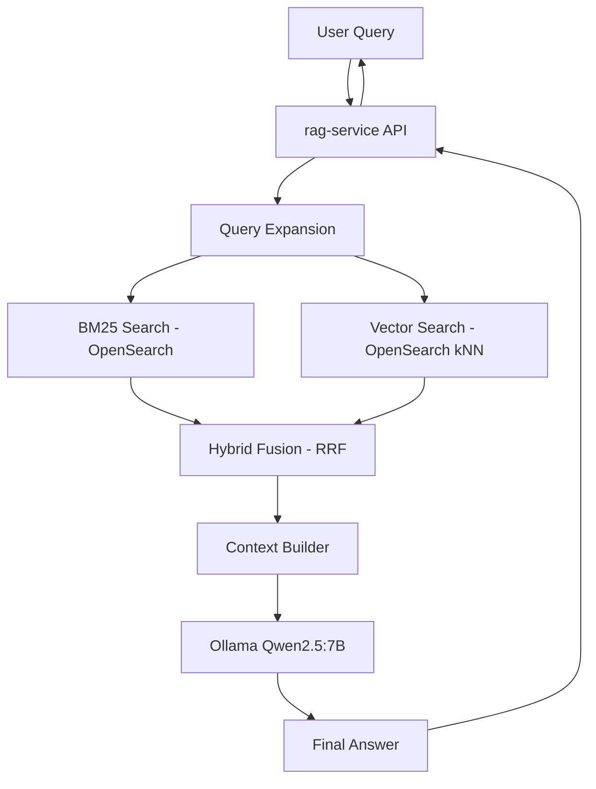

# 🚀 AI Analytics Copilot — Level 3 - Hybrid RAG + Local LLM (Ollama)

# 🚀 Level 3 - Hybrid RAG + Local LLM (Ollama)

Level 3 upgrades the AI Analytics Copilot into a full Retrieval-Augmented Generation (RAG) system with:

- BM25 lexical search (OpenSearch)
- Vector similarity search (OpenSearch k-NN)
- Hybrid ranking (RRF fusion)
- Query expansion (light semantic boost)
- Local LLM inference via Ollama (Qwen2.5:7B)
- Retrieval-aware response generation

---

## 🧱 Architecture Overview

