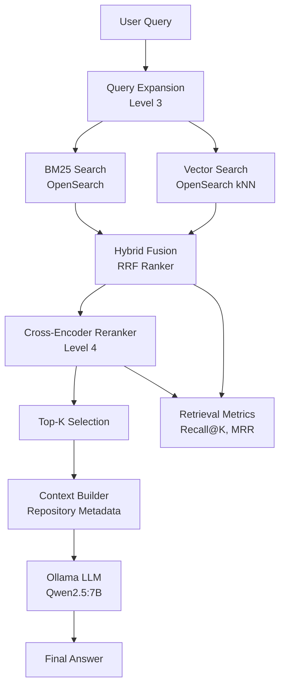

# 🚀 AI Analytics Copilot - Level 4: Advanced Retrieval-Augmented Generation (RAG)


## Overview

Level 4 introduces Advanced Retrieval-Augmented Generation (RAG) capabilities on top of the Level 3 Hybrid Retrieval platform.

The focus of this level is improving retrieval quality, ranking quality, observability, and explainability.

New capabilities include:

* Cross-Encoder Re-Ranking
* Retrieval Evaluation Metrics
* Ranking Evaluation Metrics
* Retrieval Explainability
* Retrieval Observability
* Advanced RAG Optimization

The system remains fully local and does not require any cloud-hosted AI services.

---

## Architecture

Level 4 extends the Level 3 retrieval pipeline:




---

## New Features

### 1. Cross-Encoder Re-Ranking

Level 3 returned repositories based on hybrid retrieval scores.

Level 4 introduces a Cross-Encoder model:

```text
cross-encoder/ms-marco-MiniLM-L-6-v2
```

The reranker evaluates:

```text
(query, document)
```

pairs and produces semantic relevance scores.

Benefits:

* Better ranking quality
* Improved semantic matching
* More relevant repositories near the top of the result list

---

### 2. Retrieval Evaluation

Level 4 introduces evaluation metrics for retrieval quality.

Supported metrics:

* Recall@K
* Mean Reciprocal Rank (MRR)

Example:

```text
Query:
deep learning framework

Expected:
tensorflow/tensorflow
```

Results can be evaluated automatically.

---

### 3. Ranking Evaluation

Ranking quality is measured using:

* nDCG (Normalized Discounted Cumulative Gain)

This allows comparison between:

* Hybrid Retrieval
* Cross-Encoder Re-Ranking

---

### 4. Retrieval Explainability

The retrieval pipeline is fully observable.

Developers can inspect:

* Expanded query
* BM25 results
* Vector results
* RRF fusion results
* Re-ranked results
* Retrieval metrics

---

## Available Endpoints

### Debug Retrieval

```bash
curl -X POST http://localhost:8001/debug-retrieval \
-H "Content-Type: application/json" \
-d '{"query":"deep learning framework"}'
```

Shows:

* query expansion
* BM25 results
* vector results
* hybrid fusion results

---

### Debug Re-Ranking

```bash
curl -X POST http://localhost:8001/debug-rerank \
-H "Content-Type: application/json" \
-d '{"query":"deep learning framework"}'
```

Shows:

* fused results
* reranked results
* cross-encoder scores

---

### Evaluate Retrieval

```bash
curl -X POST http://localhost:8001/eval-retrieval \
-H "Content-Type: application/json" \
-d '{
  "query":"deep learning framework",
  "expected_repo":"tensorflow/tensorflow"
}'
```

Returns:

* Recall@K
* Reciprocal Rank

---

### Batch Evaluation

```bash
curl -X POST http://localhost:8001/eval-batch-retrieval
```

Returns:

* Mean Recall
* Mean Reciprocal Rank

---

### Reranker A/B Evaluation

```bash
curl -X POST http://localhost:8001/eval-reranker-ab \
-H "Content-Type: application/json" \
-d '{
  "query":"deep learning framework",
  "expected_repo":"tensorflow/tensorflow"
}'
```

Compares:

* Hybrid Retrieval
* Hybrid + Cross-Encoder Re-Ranking

---

### Ranking Metrics

```bash
curl -X POST http://localhost:8001/eval-ranking-metrics \
-H "Content-Type: application/json" \
-d '{
  "query":"deep learning framework",
  "expected_repos":[
    "tensorflow/tensorflow",
    "pytorch/pytorch",
    "keras-team/keras",
    "apache/mxnet"
  ],
  "k":10
}'
```

Returns:

* Recall@K
* MRR
* nDCG

for both baseline and reranked results.

---

## Level 4 Outcomes

Level 4 delivers:

* Higher retrieval accuracy
* Better ranking quality
* Explainable AI outputs
* Observable retrieval performance
* Improved LLM grounding

---

## Limitations

The following capabilities are intentionally deferred to Level 5:

* Inline source citations
* Streaming responses
* Multi-LLM support
* Conversation memory
* Agentic workflows
* Prompt management

---

## Next Step: Level 5

Level 5 transforms the system from an advanced RAG platform into an enterprise AI platform.

Planned features:

* OpenAI integration
* Claude integration
* Amazon Bedrock integration
* Model abstraction layer
* Prompt management
* Conversation memory
* Agentic workflows
* LLM routing
* Streaming responses
* Citation-aware answer generation

```
```


