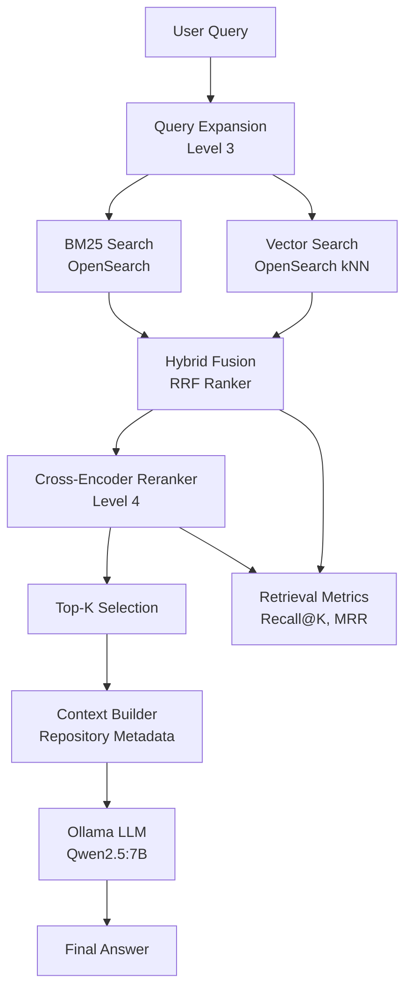

# 🚀 AI Analytics Copilot - Level 4: Advanced Retrieval-Augmented Generation (RAG)


## Overview

Level 4 introduces Advanced Retrieval-Augmented Generation (RAG) capabilities on top of the Level 3 Hybrid Retrieval platform.

The focus of this level is improving retrieval quality, ranking quality, observability, and explainability.

New capabilities include:

* Cross-Encoder Re-Ranking
* Retrieval Evaluation Metrics
* Ranking Evaluation Metrics
* Retrieval Explainability
* Retrieval Observability
* Advanced RAG Optimization

The system remains fully local and does not require any cloud-hosted AI services.

---

## Architecture

Level 4 extends the Level 3 retrieval pipeline:


---

## New Features

### 1. Cross-Encoder Re-Ranking

Level 3 returned repositories based on hybrid retrieval scores.

Level 4 introduces a Cross-Encoder model:

```text
cross-encoder/ms-marco-MiniLM-L-6-v2
```

The reranker evaluates:

```text
(query, document)
```

pairs and produces semantic relevance scores.

Benefits:

* Better ranking quality
* Improved semantic matching
* More relevant repositories near the top of the result list

---

### 2. Retrieval Evaluation

Level 4 introduces evaluation metrics for retrieval quality.

Supported metrics:

* Recall@K
* Mean Reciprocal Rank (MRR)

Example:

```text
Query:
deep learning framework

Expected:
tensorflow/tensorflow
```

Results can be evaluated automatically.

---

### 3. Ranking Evaluation

Ranking quality is measured using:

* nDCG (Normalized Discounted Cumulative Gain)

This allows comparison between:

* Hybrid Retrieval
* Cross-Encoder Re-Ranking

---

### 4. Retrieval Explainability

The retrieval pipeline is fully observable.

Developers can inspect:

* Expanded query
* BM25 results
* Vector results
* RRF fusion results
* Re-ranked results
* Retrieval metrics

---

## Available Endpoints

### Debug Retrieval

```bash
curl -X POST http://localhost:8001/debug-retrieval \
-H "Content-Type: application/json" \
-d '{"query":"deep learning framework"}'
```

Shows:

* query expansion
* BM25 results
* vector results
* hybrid fusion results

---

### Debug Re-Ranking

```bash
curl -X POST http://localhost:8001/debug-rerank \
-H "Content-Type: application/json" \
-d '{"query":"deep learning framework"}'
```

Shows:

* fused results
* reranked results
* cross-encoder scores

---

### Evaluate Retrieval

```bash
curl -X POST http://localhost:8001/eval-retrieval \
-H "Content-Type: application/json" \
-d '{
  "query":"deep learning framework",
  "expected_repo":"tensorflow/tensorflow"
}'
```

Returns:

* Recall@K
* Reciprocal Rank

---

### Batch Evaluation

```bash
curl -X POST http://localhost:8001/eval-batch-retrieval
```

Returns:

* Mean Recall
* Mean Reciprocal Rank

---

### Reranker A/B Evaluation

```bash
curl -X POST http://localhost:8001/eval-reranker-ab \
-H "Content-Type: application/json" \
-d '{
  "query":"deep learning framework",
  "expected_repo":"tensorflow/tensorflow"
}'
```

Compares:

* Hybrid Retrieval
* Hybrid + Cross-Encoder Re-Ranking

---

### Ranking Metrics

```bash
curl -X POST http://localhost:8001/eval-ranking-metrics \
-H "Content-Type: application/json" \
-d '{
  "query":"deep learning framework",
  "expected_repos":[
    "tensorflow/tensorflow",
    "pytorch/pytorch",
    "keras-team/keras",
    "apache/mxnet"
  ],
  "k":10
}'
```

Returns:

* Recall@K
* MRR
* nDCG

for both baseline and reranked results.

---

## Level 4 Outcomes

Level 4 delivers:

* Higher retrieval accuracy
* Better ranking quality
* Explainable AI outputs
* Observable retrieval performance
* Improved LLM grounding

---

## Limitations

The following capabilities are intentionally deferred to Level 5:

* Inline source citations
* Streaming responses
* Multi-LLM support
* Conversation memory
* Agentic workflows
* Prompt management

---


## 🚀 How to Run

### 📦 Why We Expanded ClickHouse Data (Level 4)

In Levels 1, 2 and 3 ClickHouse contained only a minimal dataset (2 repositories), which was sufficient for basic retrieval testing.

In Level 4, we expanded the dataset in scripts/data-load/ingest_clickhouse.py to include diverse GitHub repositories across multiple categories:

- Deep learning frameworks (TensorFlow, PyTorch, MXNet, Keras)
- ML libraries (scikit-learn)
- Data tools (Pandas, NumPy)
- Distributed systems (Spark, Kubernetes)
- DevOps platforms (Docker)
- NLP models (Transformers)

Why this matters

Level 4 introduces:

- Cross-encoder re-ranking
- Ranking metrics (MRR, nDCG)
- Retrieval evaluation (Recall@K)
- Hybrid ranking comparisons

These require a non-trivial dataset with ranking ambiguity.

Without this expansion:

- BM25 ≈ Vector results (no ranking challenge)
- RRF has no meaningful fusion
- Reranker has no discrimination signal
- Metrics always return artificially perfect scores

In short

This dataset expansion enables:

- Realistic ranking competition between repos
- Meaningful reranker evaluation
- Observable improvements in retrieval quality
- Proper benchmarking of Level 4 algorithms

**⚠️ Important**

Make sure you re-run ingestion after pulling Level 4 changes:

```bash
docker-compose run --rm indexer-service
```

or

```bash
make reset
make up
```

**👍 Why this is important for Level 4 success criteria**

This directly enables:

- ✔ Better ranking quality evaluation
- ✔ Observable retrieval performance
- ✔ Meaningful cross-encoder gains
- ✔ Valid evaluation metrics (MRR / nDCG / Recall@K)


### 1. Start the full stack

```bash
make up
```
```bash
docker ps
```

This starts all required services:

- API Gateway (RAG Service)
- Embedding Service
- OpenSearch
- ClickHouse
- Ollama (LLM runtime)
- Indexer Service
- RAG service
---

### 2. Pull the Qwen model (required once)

```bash 
docker exec -it ollama ollama pull qwen2.5:7b
```

### 3. Verify services
```bash
curl http://localhost:8001/health
```
```bash
curl http://localhost:11434/api/tags
```

### 🧪 4. Core Retrieval Tests (Level 2 + Level 3)

BM25 Search
```bash
curl -X POST http://localhost:8001/search \
-H "Content-Type: application/json" \
-d '{"query": "deep learning frameworks"}'
```

Vector Search
```bash
curl -X POST http://localhost:8001/vector-search \
-H "Content-Type: application/json" \
-d '{"query":"deep learning"}'
```

Full RAG (Hybrid + LLM)
```bash
curl -X POST http://localhost:8001/ask \
-H "Content-Type: application/json" \
-d '{"query":"what is pytorch"}'
```

### 🧠 5. Level 4 Advanced Tests

#### Debug Retrieval Pipeline

```bash
curl -X POST http://localhost:8001/debug-retrieval \
-H "Content-Type: application/json" \
-d '{"query":"deep learning framework"}'
```

#### Debug Reranker
```bash
curl -X POST http://localhost:8001/debug-rerank \
-H "Content-Type: application/json" \
-d '{"query":"deep learning framework"}'
```

#### Single Query Evaluation
```bash
curl -X POST http://localhost:8001/eval-retrieval \
-H "Content-Type: application/json" \
-d '{
  "query":"deep learning framework",
  "expected_repo":"tensorflow/tensorflow"
}'
```

#### Batch Evaluation
```bash
curl -X POST http://localhost:8001/eval-batch-retrieval
```

#### Reranker A/B Test
```bash
curl -X POST http://localhost:8001/eval-reranker-ab \
-H "Content-Type: application/json" \
-d '{
  "query":"deep learning framework",
  "expected_repo":"tensorflow/tensorflow"
}'
```

#### Ranking Metrics
```bash
curl -X POST http://localhost:8001/eval-ranking-metrics \
-H "Content-Type: application/json" \
-d '{
  "query":"deep learning framework",
  "expected_repos":[
    "tensorflow/tensorflow",
    "pytorch/pytorch",
    "keras-team/keras",
    "apache/mxnet"
  ],
  "k":10
}'
```

### 📌 Expected Behavior
- BM25 retrieves keyword matches
- Vector search retrieves semantic matches
- RRF merges retrieval signals
- Cross-encoder reranks results
- Metrics compare baseline vs reranked performance
- LLM generates grounded responses from retrieved context

### ⚠️ Troubleshooting

#### Embedding service not responding
```bash
docker logs embedding-service
```

#### Ollama model missing
```bash
docker exec -it ollama ollama pull qwen2.5:7b
```

#### OpenSearch issues
```bash
docker logs opensearch
```

## ## 🚀 Next Step: Level 5

Level 5 transforms the system from an advanced retrieval-augmented generation (RAG) platform into an enterprise-grade AI orchestration platform.

At this stage, Level 4 is considered stable and complete, focusing on:
- Retrieval quality
- Ranking evaluation
- Explainability
- Observability

Level 5 will build on this foundation by introducing multi-model intelligence and production-grade LLM orchestration.

### Planned Features (Level 5)

- Amazon Bedrock integration (primary LLM provider)
- OpenAI integration (optional external provider)
- Claude / Anthropic integration via Bedrock or API
- Model abstraction layer (unified LLM interface)
- LLM routing engine (model selection based on task type, cost, latency)
- Prompt management system (versioned and modular prompts)
- Conversation memory (short-term and long-term memory)
- Agentic workflows (tool-using reasoning pipelines)
- Streaming responses (token-level streaming from LLMs)
- Citation-aware answer generation (linking responses to retrieved sources)

### Key Architectural Shift

Level 5 introduces a new abstraction layer:

- Level 3–4: Retrieval-centric system (BM25 + Vector + RRF + Reranking)
- Level 5: LLM orchestration layer on top of retrieval

In Level 5, the system becomes:

User → Retrieval Layer → Memory Layer → LLM Router → Model Providers → Streaming Answer


