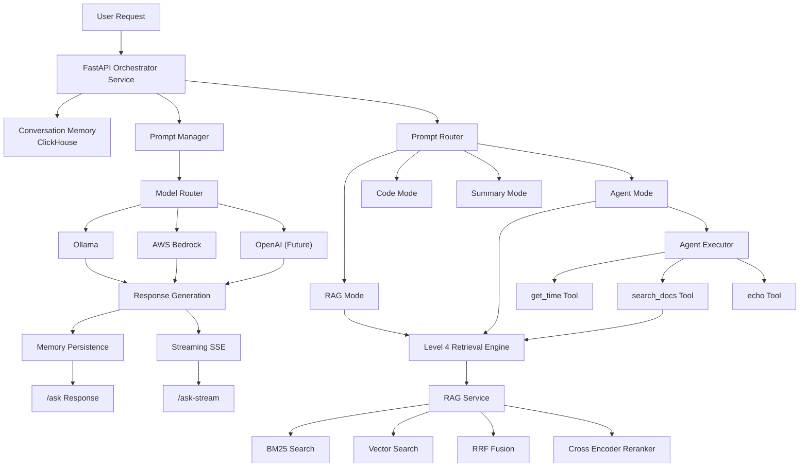

# 🚀 AI Analytics Copilot - Level 5: Enterprise AI Orchestration Layer


## Overview

Level 5 transforms the AI Analytics Copilot from an advanced Retrieval-Augmented Generation (RAG) system into an AI orchestration platform.

This release introduces:

- Multi-model routing
- Prompt management
- Conversation memory
- Agent orchestration
- Tool execution
- Streaming responses
- Retrieval reuse from Level 4
- AWS Bedrock integration framework
- Local LLM fallback via Ollama

---

# 🏗️ Architecture



---

# Features Delivered

## Multi-Model Routing

The orchestrator no longer calls models directly.

Before:

```python
ollama.generate(prompt)
```

Now:

```python
model = router.select_model(...)
model.generate(prompt)
```

Supported providers:

- Ollama
- AWS Bedrock (framework implemented)
- OpenAI (framework implemented)

---

## Prompt Management

Centralized prompt registry:

```text
prompts/
├── system_prompt.py
├── rag_prompt.py
├── code_prompt.py
├── summary_prompt.py
├── agent_prompt.py
└── prompt_router.py
```

Prompt types:

- RAG
- CODE
- SUMMARY
- AGENT

Example:

```python
prompt_manager.build_prompt(...)
```

---

## Conversation Memory

Conversation history persists in ClickHouse.

Stored:

- session_id
- query
- response
- metadata
- timestamp

Implementation:

```text
memory/
├── conversation_store.py
└── short_term.py
```

---

## Agent Orchestration

Level 5 introduces controlled agents.

Agent flow:

```text
User Request
    ↓
Planner
    ↓
Tool Selection
    ↓
Tool Execution
    ↓
Observation
    ↓
Final Answer
```

Implemented tools:

```text
get_time
search_docs
echo
```

Example:

```text
what time is it and then search docs about tensorflow and summarize results
```

Execution:

```text
Step 1 → get_time
Step 2 → search_docs
Step 3 → synthesize answer
```

---

## Retrieval Reuse

Level 4 retrieval engine remains unchanged.

The orchestrator reuses:

- BM25
- Vector Search
- Reciprocal Rank Fusion (RRF)
- Cross-Encoder Reranking

via:

```python
RagClient()
```

No retrieval logic was duplicated.

---

## Streaming Responses

Implemented endpoint:

```text
POST /ask-stream
```

Uses:

```text
Server Sent Events (SSE)
```

Example output:

```text
data: {"token":"Py"}

data: {"token":"Torch"}

data: {"token":" is"}

data: {"token":" a"}
```

---

## AWS Bedrock Framework

Implemented:

```text
BedrockModel
```

Capabilities:

- Claude Sonnet
- Claude Haiku
- IAM authentication
- Streaming support

Current deployment:

```text
Ollama active
Bedrock ready for activation
```

---

# API Endpoints

## Health Check

```http
GET /health
```

Response:

```json
{
  "status": "ok"
}
```

---

## Ask

```http
POST /ask
```

Request:

```json
{
  "query": "what is pytorch",
  "session_id": "test"
}
```

---

## Streaming

```http
POST /ask-stream
```

Request:

```json
{
  "query": "what is pytorch",
  "session_id": "test"
}
```

---

# How To Run

## Start Services

```bash
make up
```

Verify containers:

```bash
docker ps
```

Expected:

```text
api-gateway
embedding-service
rag-service
orchestrator-service
clickhouse
opensearch
ollama
```

---

## Verify Health

```bash
curl http://localhost:8003/health
```

Expected:

```json
{
  "status": "ok"
}
```

---

# Testing

## Test Standard Chat

```bash
curl -X POST http://localhost:8003/ask \
-H "Content-Type: application/json" \
-d '{
  "query":"what is pytorch",
  "session_id":"test"
}'
```

---

## Test Agent Workflow

```bash
curl -X POST http://localhost:8003/ask \
-H "Content-Type: application/json" \
-d '{
  "query":"what time is it and then search docs about tensorflow and summarize results",
  "session_id":"test"
}'
```

Expected:

- Executes get_time
- Executes search_docs
- Generates final answer

---

## Test Streaming

```bash
curl -N \
-X POST http://localhost:8003/ask-stream \
-H "Content-Type: application/json" \
-d '{
  "query":"what is pytorch",
  "session_id":"test"
}'
```

Expected:

```text
data: {"token":"Py"}

data: {"token":"Torch"}

...
```

---

## View Agent Logs

```bash
docker logs orchestrator-service -f
```

Example:

```text
[AGENT] Step 1
[AGENT] Executing tool: get_time

[AGENT] Step 2
[AGENT] Executing tool: search_docs

[AGENT] Step 3
[AGENT] Final answer generated
```

---

# Level 5 Status

## Completed

- Multi-model routing
- Prompt management system
- Conversation memory
- Agent orchestration
- Tool execution
- Streaming responses
- Retrieval reuse
- Ollama integration
- Bedrock integration framework
- ClickHouse memory persistence

---

# Next Level

Level 6 introduces:

- Evaluation pipelines
- Agent observability
- Guardrails
- Structured outputs
- Production Bedrock deployment
- Autonomous multi-agent workflows