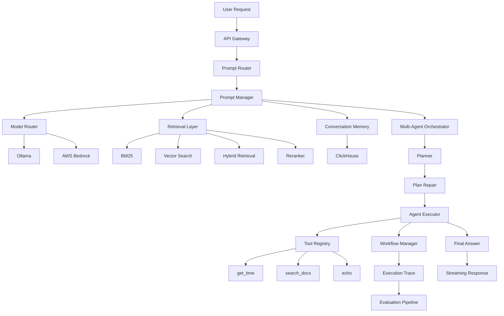

# AI Analytics Copilot – Level 6
# Production Intelligence & Control Layer

---

# 1. Vision

Level 6 transforms the platform from an intelligent orchestration system into a **production-grade AI execution platform**.

Levels 1–5 introduced:

- hybrid retrieval
- ranking intelligence
- prompt management
- model routing
- conversation memory
- multi-agent orchestration
- streaming responses

Level 6 focuses on making every AI decision:

- observable
- reproducible
- measurable
- safe
- deterministic

The platform evolves from:

```text
Enterprise AI Orchestration Platform
```

into:

```text
Production AI Execution Platform
```

The emphasis shifts from simply generating answers to understanding:

- why an answer was produced
- which tools were used
- which model generated it
- how execution proceeded
- whether execution was correct

Every request now becomes an auditable execution workflow.

---

# 2. Platform Evolution

The project has been developed incrementally, with each level introducing a distinct architectural capability.

| Level | Focus |
|---------|---------|
| Level 1 | Keyword + Embedding Ingestion Pipeline |
| Level 2 | Keyword (BM25) Retrieval Layer |
| Level 3 | Hybrid Retrieval Pipeline (BM25 + Vector + RRF) |
| Level 4 | Advanced RAG + Ranking Intelligence |
| Level 5 | Memory, Agents & Orchestration |
| Level 6 | Production Intelligence & Control |

Each level builds upon the previous one without replacing existing functionality.

```text
Level 1
        ↓
Document Ingestion

Level 2
        ↓
Keyword Retrieval

Level 3
        ↓
Hybrid RAG

Level 4
        ↓
Ranking Intelligence

Level 5
        ↓
Enterprise Orchestration

Level 6
        ↓
Production Execution Platform
```

Level 6 does not redesign retrieval or orchestration.

Instead, it industrializes the platform by adding:

- production observability
- execution tracing
- workflow management
- evaluation pipelines
- guardrails
- structured outputs
- deterministic execution

---

# 3. High-Level Architecture



The architecture intentionally separates each major responsibility into an independent subsystem.

This provides:

- modularity
- easier testing
- improved maintainability
- provider independence
- production scalability

---

# 4. What's New in Level 6

Level 5 introduced orchestration.

Level 6 introduces **control**.

New production capabilities include:

## Evaluation Pipeline

Every agent execution can now be evaluated against an expected workflow.

Implemented features include:

- deterministic replay
- alignment scoring
- coverage scoring
- ordering validation
- workflow comparison

---

## Execution Tracing

Every execution produces a complete trace.

Trace data records:

- planner decisions
- repaired plans
- tool execution
- workflow progression
- final answer generation

This enables complete execution replay.

---

## Workflow Management

Level 6 introduces workflow lifecycle management.

Each workflow tracks:

- execution state
- completed steps
- failed steps
- workflow status
- workflow identifier

---

## Guardrails

Guardrails now operate across the execution pipeline.

Protection includes:

- prompt validation
- tool permissions
- tool input validation
- execution limits
- output sanitization

---

## Structured Outputs

Level 6 introduces schema-based validation for:

- tool inputs
- tool outputs
- execution plans
- evaluation datasets

Structured outputs improve reliability by reducing malformed data entering the orchestration layer.

---

## Production Runtime

Level 6 formalizes production model routing.

Current providers include:

```text
Ollama
AWS Bedrock
```

Routing decisions are now observable and deterministic.

---

# 5. Project Structure

Level 6 expands the repository into a modular production architecture.

```text
api/
agents/
evaluation/
memory/
orchestrator/
prompts/
rag/
router/
schemas/
streaming/
tools/
workflows/
```

Major responsibilities include:

| Directory | Responsibility |
|------------|----------------|
| agents | Planning, repair and execution |
| evaluation | Workflow evaluation framework |
| memory | ClickHouse conversation memory |
| orchestrator | End-to-end request orchestration |
| prompts | Prompt templates and routing |
| router | LLM routing |
| schemas | Structured validation models |
| streaming | Server-Sent Events |
| workflows | Workflow lifecycle management |

The project follows a separation-of-concerns architecture, allowing each subsystem to evolve independently.

---

# 6. Request Lifecycle

Every request follows the same production execution pipeline.

```text
Client
    ↓
REST API
    ↓
Prompt Router
    ↓
Prompt Manager
    ↓
Retrieval Layer
    ↓
Model Router
    ↓
Agent Orchestrator
    ↓
Workflow Manager
    ↓
Tool Execution
    ↓
Execution Trace
    ↓
Evaluation Hooks
    ↓
Final Answer
    ↓
Streaming Response (optional)
```

The lifecycle remains deterministic regardless of whether the request executes as:

- Retrieval-Augmented Generation (RAG)
- Direct LLM generation
- Multi-agent execution
- Streaming response

Every request records:

- selected model
- retrieval metadata
- execution workflow
- execution trace
- latency
- conversation memory

This consistency makes the platform suitable for production deployments where reproducibility, observability and controlled execution are essential.

---

**Continue to Part 2 → API Endpoints, Request Examples and Testing**


---

# 7. API Endpoints Overview

Level 6 exposes three core production endpoints:

```text
POST /ask
POST /ask-stream
POST /evaluate
```

Each endpoint routes through the same internal pipeline:

```text
Prompt Router → Prompt Manager → Model Router → Retrieval → Execution Engine
```

But diverges depending on execution mode:

| Endpoint | Mode |
|----------|------|
| /ask | Standard execution |
| /ask-stream | Streaming execution |
| /evaluate | Deterministic evaluation replay |

---

# 8. `/ask` Endpoint (Standard Execution)

## Purpose

The `/ask` endpoint is the primary production interface for:

- RAG queries
- Agent workflows
- Direct LLM responses
- Tool execution

It supports automatic routing between:

```text
RAG → Direct LLM → Agent Mode
```

based on the Prompt Router classification.

---

## Example 1 — Simple RAG Query

```bash
curl -X POST http://localhost:8003/ask \
-H "Content-Type: application/json" \
-d '{
  "query": "what is cloud architecture"
}'
```

### Expected Response

```json
{
  "answer": "...based on retrieved context and/or model knowledge...",
  "trace": {
    "type": "rag",
    "retrieval": {
      "bm25": 2,
      "vector": 1,
      "hybrid": 2
    },
    "rerank_top": [...]
  },
  "model_used": "ollama:qwen2.5:7b",
  "latency_ms": 2100
}
```

---

## Example 2 — Agent Execution Query

```bash
curl -X POST http://localhost:8003/ask \
-H "Content-Type: application/json" \
-d '{
  "query": "what time is it"
}'
```

### Expected Execution Flow

```text
Planner Agent
   ↓
Plan Repair Agent
   ↓
Tool Execution (get_time)
   ↓
Final Answer Synthesis
```

### Expected Trace

```json
{
  "trace": {
    "steps": [
      { "tool": "planner_agent" },
      { "tool": "repair_agent" },
      { "tool": "get_time" },
      { "tool": "final_answer" }
    ]
  }
}
```

---

## Example 3 — Complex Distributed Systems Query

```bash
curl -X POST http://localhost:8003/ask \
-H "Content-Type: application/json" \
-d '{
  "query": "explain distributed systems architecture scalability tradeoffs CAP theorem"
}'
```

### Expected Behavior

- Retrieval layer activates
- Hybrid RAG returns relevant repositories
- Bedrock or Ollama selected based on complexity
- Final answer includes reasoning + tradeoffs

---

# 9. `/ask-stream` Endpoint (Streaming Execution)

## Purpose

Provides real-time token streaming using:

```text
Server-Sent Events (SSE)
```

---

## Example

```bash
curl -X POST http://localhost:8003/ask-stream \
-H "Content-Type: application/json" \
-d '{
  "query": "what is pytorch",
  "session_id": "test"
}'
```

---

## Expected Output (Streamed Tokens)

```text
data: {"token": "Py"}

data: {"token": "Torch"}

data: {"token": " is"}

data: {"token": " a"}

data: {"token": " machine learning library"}

data: {"token": "[DONE]"}
```

---

## Streaming Pipeline

```text
Model.generate_stream()
        ↓
Token-by-token output
        ↓
SSE formatter
        ↓
HTTP response stream
```

---

## Key Features

- Low latency UX
- Partial response rendering
- Session-aware streaming
- Works with both Ollama and Bedrock models

---

# 10. `/evaluate` Endpoint (Evaluation Engine)

## Purpose

The evaluation endpoint is a **Level 6 production control feature**.

It allows:

- deterministic replay of agent execution
- validation of tool usage
- scoring of pipeline correctness
- regression testing of orchestration logic

---

## Example Request

```bash
curl -X POST http://localhost:8003/evaluate \
-H "Content-Type: application/json" \
-d '{
  "dataset": [
    {
      "id": "repair-test",
      "query": "what time is it",
      "expected_steps": [
        {
          "tool": "get_time",
          "args": {}
        }
      ]
    }
  ]
}'
```

---

## Expected Output

```json
{
  "summary": {
    "total": 1,
    "passed": 1,
    "failed": 0,
    "score": 1.0
  },
  "results": [
    {
      "id": "repair-test",
      "passed": true,
      "score": 1.0,
      "step_scores": [
        {
          "expected": "get_time",
          "actual": "get_time",
          "score": 1.0
        }
      ]
    }
  ]
}
```

---

## Evaluation Metrics

The system computes:

- alignment score
- tool execution accuracy
- ordering correctness
- trace consistency
- failure penalties

---

## Execution Model

```text
Dataset → Planner → Executor → Trace Replay → Scoring Engine → Report
```

---

# 11. Model Routing Layer

## Purpose

The Model Router selects the optimal LLM based on:

- query complexity
- prompt type
- context size
- agent mode

---

## Supported Models

```text
Ollama (qwen2.5)
AWS Bedrock (Claude Haiku)
AWS Bedrock (Claude Sonnet)
```

---

## Routing Strategy

```python
if complexity == "low":
    use Ollama

elif complexity == "medium":
    use Claude Haiku

elif complexity == "high":
    use Claude Sonnet
```

---

## Observability

Each request logs:

- selected model
- routing decision
- latency
- cost tier (conceptual)

---

# 12. Retrieval Pipeline (Level 4 → 6 Integration)

## Overview

Level 6 reuses the Level 4 retrieval system:

- BM25 keyword search
- Vector search
- Hybrid fusion (RRF)
- Reranking layer

---

## Pipeline Flow

```text
Query
  ↓
BM25 Search
  ↓
Vector Search
  ↓
Hybrid Fusion (RRF)
  ↓
Cross Encoder Reranker
  ↓
Context Builder
```

---

## Integration in Level 6

Retrieval is embedded inside:

```text
PromptManager.build_prompt()
```

which formats:

- retrieved documents
- conversation history
- system prompt

---

## Example Retrieval Output

```json
{
  "bm25_results": 2,
  "vector_results": 1,
  "hybrid_results": 3,
  "reranked_top": [
    {
      "repo_name": "apache/spark",
      "score": 0.92
    }
  ]
}
```

---

## Key Design Principle

Level 6 does NOT replace retrieval.

It enhances how retrieval is:

- consumed
- traced
- evaluated
- validated

---

## Next Section Preview

**Part 3 will cover:**

- Memory system (ClickHouse integration)
- Multi-agent orchestration (Planner → Repair → Executor)
- Workflow manager
- Tool registry
- Guardrails system
- Structured outputs
```

---

# 13. Memory Layer (ClickHouse Conversation Store)

Level 6 continues to use the Level 5 memory system, built on **ClickHouse**.

## Implementation

```text
ConversationMemory → ConversationStore → ClickHouse
```

---

## Stored Data Model

Each interaction is persisted as:

```json
{
  "event_id": "uuid",
  "session_id": "string",
  "timestamp": "datetime",
  "query": "user input",
  "response": "assistant output",
  "metadata": {
    "model": "...",
    "trace": "...",
    "mode": "agent | rag"
  }
}
```

---

## Usage in Pipeline

Memory is accessed in `OrchestrationPipeline.run()`:

```python
history = self.memory.get(session_id)
```

And appended after every response:

```python
self.memory.append(session_id, query, answer, metadata)
```

---

## Design Purpose

Memory enables:

- conversational continuity
- session-level context injection
- debugging via historical replay
- future personalization layer (Level 7 roadmap)

---

# 14. Multi-Agent Orchestration System

Level 6 formalizes multi-agent execution as a **controlled pipeline**, not autonomous agents.

## Core Flow

```text
Planner → Repair → Executor → Workflow Manager → Final Answer
```

---

## Implementation Entry Point

```python
MultiAgentOrchestrator.run()
```

---

## Responsibilities

### Planner Agent
- Converts query into structured execution plan
- Outputs tool-level steps

```json
{
  "steps": [
    { "tool": "get_time", "args": {} }
  ]
}
```

---

### Plan Repair Agent

Ensures robustness of generated plans:

- fixes invalid tool calls
- normalizes arguments
- validates structure
- ensures executable format

```python
repaired_plan = self.repair.repair(plan, query)
```

---

### Executor

Delegates execution to:

```text
AgentExecutor
```

---

### Critic Agent (optional)

- evaluates final result quality
- attaches critique metadata
- does not block execution

---

# 15. Agent Execution Engine (AgentExecutor)

This is the **core runtime engine** of Level 6.

---

## Responsibilities

The executor handles:

- tool execution
- schema validation
- guardrail enforcement
- step tracing
- workflow integration
- failure handling

---

## Execution Flow

For each planned step:

```text
validate tool
→ check permissions
→ validate inputs
→ execute tool
→ validate outputs
→ record trace
→ update workflow state
```

---

## Tool Execution Budget

A hard limit is enforced:

```python
max_tool_calls = Guardrails.max_tool_calls
```

If exceeded:

```text
execution stops immediately
```

---

## Trace Logging

Each execution step produces:

```json
{
  "step": 1,
  "tool": "get_time",
  "event_type": "tool_execution",
  "output": "...",
  "latency_ms": 3
}
```

---

## Failure Handling

Failures do NOT crash execution.

Instead:

- recorded in trace
- marked in workflow
- execution continues or stops safely depending on severity

---

# 16. Workflow Manager

The Workflow Manager tracks execution state across the entire agent lifecycle.

---

## Workflow States

```text
created → running → completed
                 ↘ failed
                 ↘ completed_with_errors
```

---

## Responsibilities

- track execution lifecycle
- store completed steps
- store failed steps
- enforce step progression consistency

---

## Integration Point

Injected into executor:

```python
workflow = self.workflow_manager.create_workflow(query)
workflow.start()
```

---

## Step Tracking

```python
workflow.complete_step(tool_name)
workflow.fail_step(tool_name)
```

---

## Design Goal

Ensure every execution is:

- stateful
- replayable
- auditable

---

# 17. Guardrails System (Production Safety Layer)

Guardrails enforce safety and correctness across execution.

---

## 3 Layers of Protection

### 1. Input Guardrails

- prompt injection detection
- unsafe query filtering
- early request rejection

```python
validate_prompt(query)
```

---

### 2. Tool Guardrails

- permission control
- input validation
- execution limits

```python
validate_tool_permission(tool_name)
validate_tool_input(tool_name, args)
```

---

### 3. Output Guardrails

- output sanitization
- structured format enforcement
- schema compliance checks

```python
validate_tool_output(tool_name, output)
```

---

## Tool Execution Limit

Hard safety constraint:

```text
max_tool_calls enforced globally
```

Prevents:

- infinite loops
- runaway agents
- cost explosions

---

# 18. Prompt Management + Routing Layer

The Prompt Manager is responsible for constructing **execution-ready prompts**.

---

## Prompt Router

Classifies user intent into:

```text
RAG | CODE | AGENT | SUMMARY
```

---

## Prompt Manager Flow

```text
Query
  ↓
Prompt Router
  ↓
Prompt Template Selection
  ↓
Context Injection
  ↓
Final Prompt Assembly
```

---

## Prompt Types

### RAG Prompt

Used for retrieval-based queries:

- includes context documents
- includes conversation history
- enforces grounded responses

---

### Agent Prompt

Used for multi-step execution:

- triggers planner + tool execution pipeline
- does not rely purely on context

---

### Code Prompt

Used for programming-related queries

---

### Summary Prompt

Used for compression / summarization tasks

---

## History Integration (Important Fix)

Level 6 currently supports memory retrieval:

```python
history = self.memory.get(session_id)
```

But history injection is intentionally controlled:

- only last N messages used
- avoids prompt explosion
- preserves context relevance

---

## Output

Prompt Manager returns:

```python
{
  "prompt": "...",
  "type": "rag | agent | code | summary"
}
```

---

## Design Goal

Ensure:

- deterministic prompt construction
- consistent model behavior
- clean separation between retrieval, memory, and reasoning

---

# End of Part 3

Next section:

👉 **Part 4 will cover:**
- structured outputs system
- observability & tracing design
- evaluation pipeline (`/evaluate`)
- streaming system (`/ask-stream`)
- Bedrock runtime integration
- error handling + constraints


## 21. Structured Outputs System

Level 6 introduces a lightweight structured output discipline, implemented through:

- Prompt constraints (primary mechanism)
- Post-processing validation hooks (partial)
- Agent-level synthesis formatting
- Trace enrichment for evaluation

Unlike a fully strict schema enforcement system, Level 6 uses a hybrid approach:

> **"Structure is enforced by design, not strictly by runtime validators."**

### 21.1 Output Contract Shape

Across `/ask`, `/ask-stream`, and agent execution flows, responses follow:

```json
{
  "answer": "string",
  "trace": "object",
  "session_id": "string",
  "model_used": "string",
  "latency_ms": "number"
}
```

Agent mode extends this:

```json
{
  "answer": "string",
  "trace": "object",
  "workflow": "object",
  "critique": "optional"
}
```

### 21.2 Agent Final Answer Structuring

Implemented in `AgentExecutor._final_answer()`:

- Tool outputs are concatenated
- A final LLM synthesis prompt is constructed
- Model returns a natural-language response (not JSON)

```
USER: {query}

TOOLS:
{tool_results}

Return a concise final answer.
```

### 21.3 Structured Output Reality

> ⚠️ **Important Constraint**

| Status | Detail |
|---|---|
| ❌ | No enforced JSON schema validation at runtime (validator commented out) |
| ⚠️ | Output structure depends on prompt discipline |
| ✅ | Trace and metadata are strictly structured |

This is intentional for Level 6 stability — it avoids brittle failure modes during multi-agent reasoning.

### 21.4 Future Upgrade Path

Planned evolution:

- Strict Pydantic / schema enforcement
- Retry-on-invalid-output loops
- Tool-level typed contracts (`ToolAction`, `FinalAnswer`)
- Deterministic JSON mode for production APIs

---

## 22. Observability & Tracing System

Level 6 implements full execution observability per request.

### 22.1 Core Trace Objects

**`AgentTrace`** — captures the full execution lifecycle:

- Planner step
- Repair step
- Tool execution steps
- Final answer generation

**`StepTrace`** — per-step detail:

```json
{
  "step": 1,
  "tool": "planner_agent",
  "event_type": "plan",
  "args": {},
  "output": {},
  "success": true,
  "latency_ms": 12
}
```

### 22.2 Trace Flow Architecture

Every `/ask` request produces:

```
Request
  → Router
  → Prompt Manager
  → Model Selection
  → (Optional) Agent Orchestrator
  → Tool Execution
  → Final Answer
  → Trace Assembly
```

### 22.3 Observability Coverage

Tracked dimensions:

- Model used (Ollama / Bedrock)
- Tool execution steps
- Tool failures
- Plan repair modifications
- Retrieval counts (BM25 / vector / hybrid)
- Latency per execution stage

### 22.4 Replayability

> Every agent run is replayable from structured trace logs.

This enables:

- Debugging
- Evaluation scoring
- Regression testing

---

## 23. Evaluation Pipeline (`/evaluate`)

Level 6 introduces a deterministic evaluation subsystem.

### 23.1 Endpoint

```
POST /evaluate
```

### 23.2 Input Format

```json
{
  "dataset": [
    {
      "id": "test-1",
      "query": "what time is it",
      "expected_steps": [
        {
          "tool": "get_time",
          "args": {}
        }
      ]
    }
  ]
}
```

### 23.3 Evaluation Execution Flow

```
Dataset
  → Orchestrator Replay
  → Trace Capture
  → Step Matching
  → Scoring Engine
  → Summary Output
```

### 23.4 Output Format

```json
{
  "summary": {
    "total": 1,
    "passed": 1,
    "failed": 0,
    "score": 1.0
  },
  "results": [
    {
      "id": "test-1",
      "passed": true,
      "score": 1.0,
      "step_scores": [
        {
          "expected": "get_time",
          "actual": "get_time",
          "score": 1.0
        }
      ]
    }
  ]
}
```

### 23.5 Key Capabilities

- Deterministic replay of agent workflows
- Tool-level correctness scoring
- Trace-based evaluation (not text similarity)
- Foundation for CI/CD regression testing

---

## 24. Streaming System (`/ask-stream`)

Level 6 implements SSE-based token streaming.

### 24.1 Endpoint

```
POST /ask-stream
```

### 24.2 Streaming Format (SSE)

Each token is streamed as:

```
data: {"token": "Py"}
data: {"token": "Torch"}
data: {"token": " is"}
...
data: {"token": "[DONE]"}
```

### 24.3 Implementation

Located in `OrchestrationPipeline._stream_response()`.

Key behaviour:

- Uses `model.stream()`
- Buffers full response internally
- Emits token-by-token SSE events
- Stores final response in memory

### 24.4 Memory Integration

After streaming completes:

```python
self.memory.append(session_id, query, full_response)
```

Ensures streaming does not break the persistence layer.

### 24.5 Design Benefits

- Low perceived latency
- Compatible with Ollama and Bedrock
- Stateless HTTP streaming
- Works with both agent and non-agent modes

---

## 25. Bedrock Runtime Integration

Level 6 includes production-ready Bedrock support at the framework level.

### 25.1 Model Routing

Handled by `ModelRouter.select_model()`:

| Workload | Routing Decision |
|---|---|
| High complexity | Claude (Bedrock) |
| Low latency | Ollama |
| Balanced workloads | Haiku / Sonnet split |

### 25.2 Supported Providers

| Provider | Role |
|---|---|
| Ollama | Local inference |
| AWS Bedrock | Claude models (production) |
| OpenAI | Pluggable abstraction layer |

### 25.3 Execution Abstraction

Unified interface across all providers:

```python
model.generate(prompt)
model.stream(prompt)
```

All providers conform to the same input contract, output format, and traceability expectations.

### 25.4 Current Production State

- Bedrock integration is enabled via router
- Not hard-locked as the exclusive runtime
- Used dynamically based on complexity scoring

### 25.5 Latency Tracking

Each model response includes:

```json
"latency_ms": 5122
```

Used in evaluation scoring and routing optimisation.

---

## 26. Error Handling & Resilience Model

Level 6 introduces multi-layer failure isolation.

### 26.1 Guardrail-Level Protection

Implemented in `Guardrails`:

- Prompt injection detection
- Tool permission checks
- Input validation
- Execution limits

### 26.2 Pipeline Resilience

From `OrchestrationPipeline.run()`:

| Scenario | Behaviour |
|---|---|
| Guardrail rejection | Early exit |
| Missing model output | Fallback string returned |
| Agent failure | Does not break retrieval path |
| Memory writes | Isolated from execution success |

### 26.3 Tool Execution Safety

In `AgentExecutor`:

```python
max_tool_calls = 10
```

- Hard stop on overflow
- Tool permission gating
- Input schema validation (best-effort)

### 26.4 Failure Types Handled

| Failure Type | Handling Strategy |
|---|---|
| Tool missing | Logged and skipped |
| Tool crash | Converted to error string |
| Schema failure | Trace preserved, execution continues |
| Guardrail block | Early termination |
| Model empty output | Fallback response returned |

---

## 27. System Constraints (Hard Production Rules)

### 27.1 Tool Execution Constraints

- Max tool calls enforced
- No infinite loops permitted
- Step-by-step execution only
- Tool registry is authoritative

### 27.2 Memory Constraints

- Only last **5 messages** used in context
- ClickHouse used for persistence
- Memory append is non-blocking by design assumption

### 27.3 Determinism Constraints

- Every run produces a full trace
- No hidden tool execution allowed
- All agent steps must be observable
- Replay must reproduce the same execution path

### 27.4 Prompt Safety Constraints

- Injection detection applied before routing
- Unsafe queries blocked before LLM call
- Guardrails act as the first execution layer

---

## 28. Success Criteria (Level 6 Completion Definition)

### 28.1 Observability Completeness

Every request includes:

- Full `AgentTrace`
- Step-level tool logs
- Model selection metadata
- Retrieval statistics

### 28.2 Evaluation Readiness

System supports:

- `/evaluate` dataset replay
- Deterministic scoring
- Trace-based validation
- Regression comparison capability

### 28.3 Structured Output Compliance

- Responses consistently structured
- Trace always present
- Tool outputs validated where possible

### 28.4 Guardrail Enforcement

- Prompt injection blocked
- Tool misuse prevented
- Execution limits enforced

### 28.5 Production Routing Stability

- Bedrock used for high-complexity workloads
- Ollama used for low-latency workloads
- Routing decisions logged per request

---

## 29. Current Limitations (Known Gaps)

### 29.1 Retrieval Layer

- No learned ranking model
- Reranking is heuristic-based
- Context injection is static

### 29.2 Memory System

- No long-term semantic memory
- No summarisation compression layer
- No cross-session reasoning graph

### 29.3 Evaluation Pipeline

- Not integrated into CI/CD
- No automatic model tuning loop
- No online learning feedback

### 29.4 Multi-Agent System

- Deterministic but not adaptive
- No dynamic agent spawning
- No reinforcement optimisation

### 29.5 Observability

- Traces not yet centralised
- No dashboard integration
- No alerting system

---
## 30. Level 7 Roadmap

Level 7 transitions the AI Analytics Copilot from a locally orchestrated platform into a fully cloud-native AI platform running on AWS.

Rather than introducing new AI capabilities, Level 7 focuses on cloud deployment, scalability, security, automation, and operational excellence.

---

### 30.1 Kubernetes Platform (Amazon EKS)

Deploy every service onto Amazon EKS.

Core workloads include:

- Orchestrator API
- Retrieval Service
- Reranking Service
- Ollama Runtime (development clusters only)
- ClickHouse
- OpenSearch
- NGINX Ingress Controller
- Evaluation Service
- Observability Components

Deployment objectives:

- High availability
- Self-healing workloads
- Rolling updates
- Horizontal scaling
- Production-grade orchestration

---

### 30.2 Infrastructure as Code (Terraform)

Provision the complete AWS platform using Terraform.

Infrastructure components include:

- Amazon EKS
- Amazon VPC
- Public and Private Subnets
- NAT Gateways
- Internet Gateway
- Route Tables
- Security Groups
- IAM Roles
- IAM Roles for Service Accounts (IRSA)
- Amazon ECR
- Route 53
- ACM Certificates
- Application Load Balancer
- CloudWatch Resources

Terraform modules will be organised into reusable components for:

- Networking
- Kubernetes
- Security
- Storage
- Monitoring
- AI Platform Services

Benefits include:

- Version-controlled infrastructure
- Repeatable deployments
- Environment consistency
- Simplified infrastructure management

---

### 30.3 GitHub Actions CI/CD Pipeline

Automate the complete build, test, and deployment lifecycle using GitHub Actions.

Pipeline stages:

```text
Developer Push
        │
        ▼
GitHub Actions
        │
        ▼
Code Quality Checks
        │
        ▼
Unit Tests
        │
        ▼
Docker Image Build
        │
        ▼
Container Security Scanning
        │
        ▼
Push Images to Amazon ECR
        │
        ▼
Terraform Plan
        │
        ▼
Terraform Apply
        │
        ▼
Deploy to Amazon EKS
        │
        ▼
Integration Tests
        │
        ▼
Evaluation Pipeline
        │
        ▼
Production
```

Deployment capabilities:

- Automated infrastructure provisioning
- Continuous Delivery (CD)
- Rolling deployments
- Blue/Green deployments
- Canary deployments
- Automatic rollback on failure

---

### 30.4 Cloud-Native Storage

Replace local infrastructure with managed AWS services where appropriate.

Services include:

- Amazon OpenSearch Service
- Amazon EFS
- Amazon S3
- Amazon ECR
- Amazon CloudWatch

ClickHouse will initially remain self-managed on Kubernetes with the option to migrate to a managed analytics platform in future releases.

---

### 30.5 Security & Identity

Harden the platform for enterprise production use.

Security features include:

- IAM Roles for Service Accounts (IRSA)
- AWS Secrets Manager
- AWS Systems Manager Parameter Store
- Kubernetes RBAC
- Pod Security Standards
- Kubernetes Network Policies
- TLS encryption
- Encryption at rest
- Encryption in transit

---

### 30.6 Observability Platform

Extend the Level 6 tracing framework into a cloud-native observability platform.

Integrate with:

- Amazon CloudWatch
- CloudWatch Logs
- CloudWatch Metrics
- AWS X-Ray (optional)
- Prometheus
- Grafana

Operational dashboards will include:

- Request latency
- Model routing decisions
- Tool execution metrics
- Retrieval performance
- Evaluation scores
- Error rates
- Kubernetes resource utilisation

---

### 30.7 Autoscaling

Enable automatic scaling across the Kubernetes platform.

Implement:

- Horizontal Pod Autoscaler (HPA)
- Cluster Autoscaler
- Managed Node Groups
- Resource Requests and Limits
- Pod Disruption Budgets

Objectives:

- Elastic scalability
- High availability
- Cost optimisation

---

### 30.8 Production Operations

Prepare the platform for continuous enterprise operation.

Operational capabilities include:

- Readiness probes
- Liveness probes
- Health monitoring
- Graceful shutdown
- Rolling upgrades
- Disaster recovery procedures
- Backup and restore strategy
- Multi-Availability Zone deployment

---

### 30.9 Production Readiness

By the completion of Level 7 the AI Analytics Copilot will be:

- Fully deployed on Amazon EKS
- Provisioned entirely with Terraform
- Automatically deployed using GitHub Actions
- Highly available
- Horizontally scalable
- Secure by default
- Fully observable
- Cloud-native
- Production ready

Docker Compose will remain available exclusively as the local development environment, while Amazon EKS becomes the primary production deployment platform.

## Final Statement

Level 6 completes the transition from:

```
AI System  →  Controlled AI Platform
```

with:

- Deterministic traces
- Evaluation infrastructure
- Guardrailed execution
- Structured outputs (soft enforced)
- Production-grade routing
- Streaming + memory + tools integration