# Level 7 — End-to-End Environment Provisioning and Validation

## Purpose

This document records the end-to-end process used to provision a **new AWS/EKS environment**, build and publish the required container images, bootstrap the Kubernetes platform, deploy the AI Analytics Copilot application, configure local Kubernetes access, and validate the resulting environment.

It is intended to be used as a **reproducible Level 7 deployment and test record**.

The process should be executed from a clean environment using the GitHub repository:

```text
https://github.com/eyespan/ai-analytics-copilot
```

> **Level 7 release note:** This document is intended to accompany the frozen `level7` implementation before the `level7_stable` tag is created.

---

# 1. Create a New Environment

## 1.1 Obtain AWS credentials and configure GitHub Actions secrets

Before starting the deployment, obtain the AWS credentials required for the initial GitHub Actions bootstrap process.

In the GitHub repository:

**Settings → Secrets and variables → Actions → Repository secrets**

Create/update the following repository secrets:

```text
AWS_ACCOUNT_ID
AWS_ACCESS_KEY_ID
AWS_SECRET_ACCESS_KEY
```

These credentials are used by the initial AWS bootstrap workflow.

### Screenshot

> **Screenshot placeholder:** GitHub Actions repository secrets showing the configured repository secrets.
>
> **Do not capture or publish the secret values themselves.** The screenshot should only demonstrate that the required secret names are configured.

```text
[ SCREENSHOT: GitHub → Settings → Secrets and variables → Actions → Repository secrets ]
```
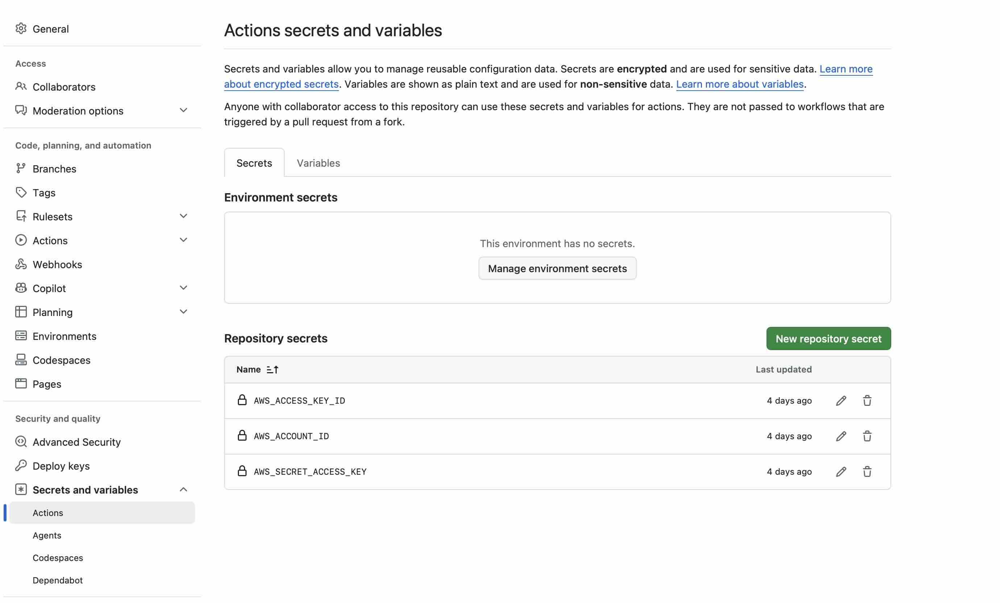

### Optional local AWS verification

Configure the AWS CLI profile that will be used for local access and validation.

For example:

```bash
aws configure --profile <profile-name>
```

Verify the identity:

```bash
aws sts get-caller-identity --profile <profile-name>
```

Example output:

```text
{
    "UserId": "...",
    "Account": "...",
    "Arn": "..."
}
```

### Command-line output placeholder

```text
[ CLI OUTPUT: aws sts get-caller-identity --profile <profile-name> ]
```


> **Security:** Do not publish access keys, secret keys, session tokens, or other sensitive credentials in screenshots or command output.

---

# 1.2 Create the IAM OIDC deployment role

Run the GitHub Actions workflow:

**Bootstrap AWS OIDC**

The purpose of this workflow is to create/configure the GitHub Actions AWS identity used for subsequent Terraform/deployment operations.

The intended flow is:

```text
GitHub Actions
      │
      ▼
Bootstrap AWS OIDC
      │
      ▼
AWS IAM OIDC provider / deployment role
      │
      ▼
Bootstrap S3 bucket for Terraform state file
      │
      ▼
Terraform / deployment workflows
```

Wait for the workflow to complete successfully before continuing.

### Screenshot

```text
[ SCREENSHOT: GitHub Actions → Bootstrap AWS OIDC → successful workflow run ]
```
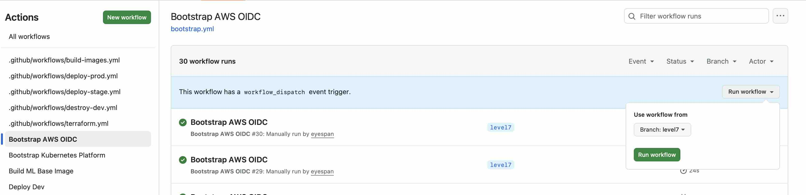
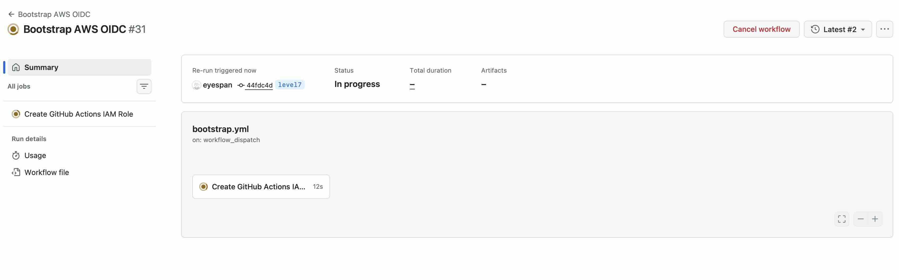


### Command-line output placeholder

If the workflow output contains useful IAM/OIDC information, record the relevant non-sensitive output here.

```text
[ CLI OUTPUT: Bootstrap AWS OIDC IAM role & Terrform S3 bucket verification ]
```

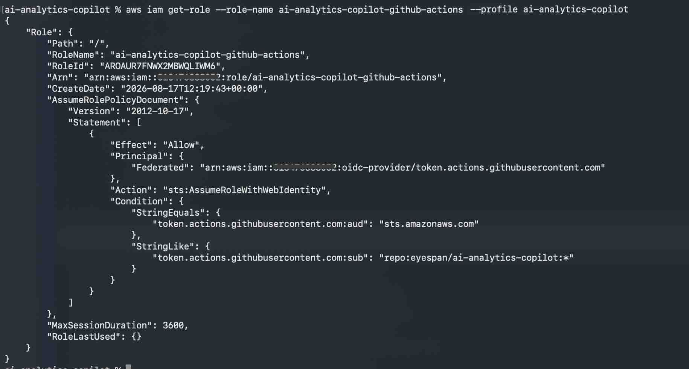
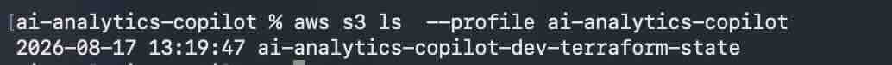


---

# 1.3 Provision the base AWS infrastructure

## Terraform Plan

Before applying infrastructure, run the:

**Terraform Plan**

workflow and review the proposed changes.

### Screenshot

```text
[ SCREENSHOT: Terraform Plan → successful workflow / plan summary ]
```
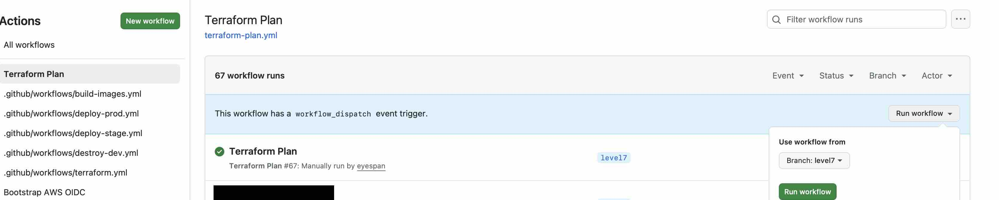
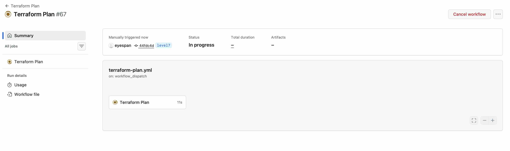
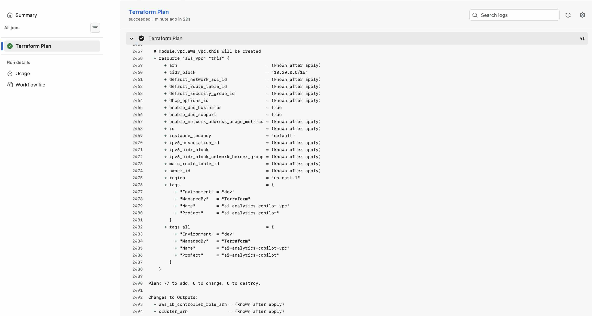

## Terraform Apply

Run the:

**Terraform Apply**

workflow.

Wait until the workflow completes successfully.

The Terraform deployment creates the AWS infrastructure required by the remaining stages.

### Infrastructure created

The new environment includes the base resources required by Level 7, including:

### (i) EKS cluster components

Examples include:

```text
EKS control plane
Managed node groups
EKS managed add-ons
OIDC provider
Cluster networking
Kubernetes storage integration
```

### (ii) ECR repositories

The container image repositories required by the application deployment are created in Amazon ECR.

### (iii) IAM roles

The environment creates the IAM/IRSA roles required by the platform and workloads.

### Screenshot placeholders

```text
[ SCREENSHOT: Terraform Apply → successful workflow ]
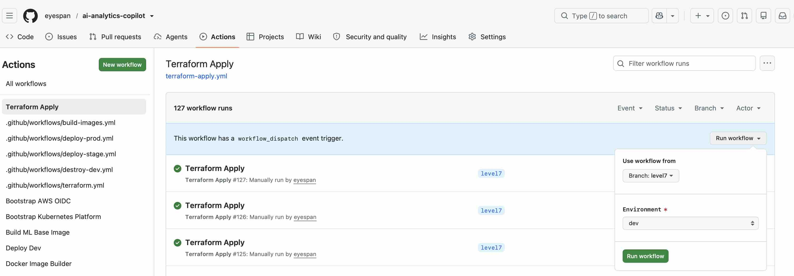
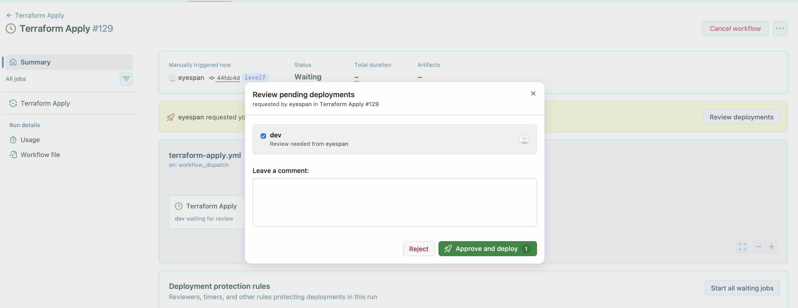
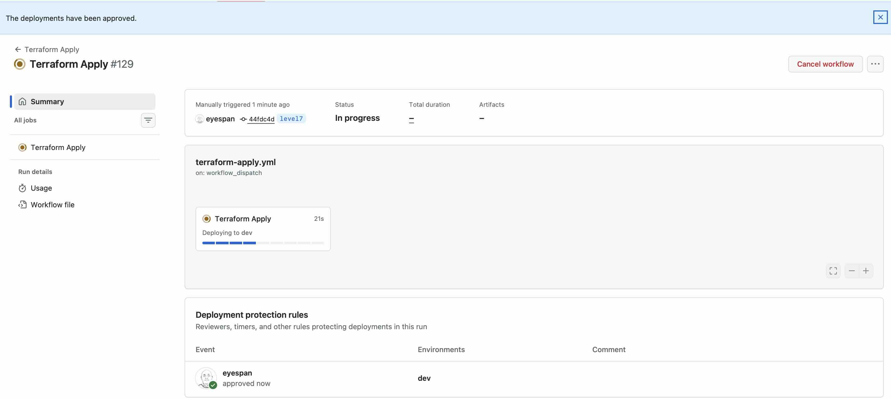

[ SCREENSHOT: AWS Console → EKS cluster ]

[ SCREENSHOT: AWS Console → ECR repositories ]

[ SCREENSHOT: AWS Console → IAM roles / relevant deployment roles ]
```

### Command-line validation

Verify that the cluster exists:

```bash
aws eks describe-cluster \
  --name <cluster-name> \
  --region us-east-1 \
  --profile <profile-name> \
  --query 'cluster.status'
```

Expected:

```text
"ACTIVE"
```

Verify ECR repositories:

```bash
aws ecr describe-repositories \
  --region us-east-1 \
  --profile <profile-name>
```

### Output placeholders

```text
[ CLI OUTPUT: aws eks describe-cluster ... ]

[ CLI OUTPUT: aws ecr describe-repositories ... ]
```

---

# 2. Build the ML Base Image

After the Terraform Apply workflow has completed successfully and the required ECR infrastructure exists, run:

**Build ML Base Image**

This workflow builds the ML base image and uploads it to Amazon ECR.

### Screenshot

```text
[ SCREENSHOT: GitHub Actions → Build ML Base Image → successful workflow ]
```

### ECR validation

Verify that the image exists:

```bash
aws ecr describe-images \
  --repository-name ml-base \
  --region us-east-1 \
  --profile <profile-name>
```

> Adjust the repository name if the environment uses a different ECR repository name.

### Output placeholder

```text
[ CLI OUTPUT: AWS ECR ML base image ]
```

---

# 3. Build Docker Images and Upload to ECR

Run the GitHub Actions workflow:

**Docker Image Builder**

The workflow builds and uploads the application/supporting images:

```text
api-gateway
embedding-service
indexer-service
rag-service
orchestrator-service
frontend
clickhouse-seed
embedding-ingest
```

### Screenshot

```text
[ SCREENSHOT: GitHub Actions → Docker Image Builder → successful workflow ]
```

### ECR verification

List the ECR repositories:

```bash
aws ecr describe-repositories \
  --region us-east-1 \
  --profile <profile-name> \
  --query 'repositories[].repositoryName'
```

Verify images have been pushed:

```bash
aws ecr describe-images \
  --repository-name <repository-name> \
  --region us-east-1 \
  --profile <profile-name>
```

Repeat for the application repositories as required.

### Output placeholders

```text
[ CLI OUTPUT: ECR repository list ]

[ CLI OUTPUT: ECR image list / tags ]
```

---

# 4. Bootstrap the Kubernetes Platform

After EKS exists and the required images are available, run:

**Bootstrap Kubernetes Platform**

This prepares the EKS cluster for application deployment.

The platform bootstrap establishes the Kubernetes and supporting platform components required by the application stack.

Examples include:

```text
AWS Load Balancer Controller
NGINX Ingress
Metrics Server
Prometheus / Grafana monitoring
ClickHouse
OpenSearch
Ollama
initialisation jobs
```

The exact components should be validated against the workflow output for the specific environment.

### Screenshot

```text
[ SCREENSHOT: GitHub Actions → Bootstrap Kubernetes Platform → successful workflow ]
```

### Local verification

After the workflow succeeds, configure your kubeconfig as described in Section 6, then run:

```bash
kubectl get nodes
```

Expected nodes should be:

```text
Ready
```

Check platform pods:

```bash
kubectl get pods -A
```

Check platform services:

```bash
kubectl get svc -A
```

### Output placeholders

```text
[ CLI OUTPUT: kubectl get nodes ]

[ CLI OUTPUT: kubectl get pods -A ]

[ CLI OUTPUT: kubectl get svc -A ]
```

---

# 5. Deploy Dev

After the Kubernetes platform bootstrap has completed successfully, run:

**Deploy Dev**

This workflow deploys the application containers into the EKS environment.

The application deployment includes:

```text
api-gateway
orchestrator-service
rag-service
embedding-service
indexer-service
frontend
```

and supporting Jobs/services required by the environment.

### Screenshot

```text
[ SCREENSHOT: GitHub Actions → Deploy Dev → successful workflow ]
```

### Validate application workloads

```bash
kubectl get pods -n ai-analytics
```

```bash
kubectl get svc -n ai-analytics
```

```bash
kubectl get ingress -n ai-analytics
```

### Expected result

The application pods should reach a ready/running state.

Example:

```text
NAME                                  READY   STATUS    RESTARTS
api-gateway-...                       1/1     Running   0
orchestrator-service-...              1/1     Running   0
rag-service-...                       1/1     Running   0
embedding-service-...                 1/1     Running   0
indexer-service-...                   1/1     Running   0
frontend-...                          1/1     Running   0
```

### Output placeholders

```text
[ CLI OUTPUT: kubectl get pods -n ai-analytics ]

[ CLI OUTPUT: kubectl get svc -n ai-analytics ]

[ CLI OUTPUT: kubectl get ingress -n ai-analytics ]
```

---

# 6. Update Your Kubeconfig

After the EKS cluster has been created and the deployment is available, configure local `kubectl` access.

Make sure the required AWS profile exists in both:

```text
~/.aws/config
~/.aws/credentials
```

The profile name used below must match the configured AWS CLI profile.

Run:

```bash
aws eks update-kubeconfig \
  --name <cluster-name> \
  --region us-east-1 \
  --profile <profile-name>
```

Verify the active context:

```bash
kubectl config current-context
```

Then verify cluster access:

```bash
kubectl get nodes
```

### AWS profile check

Verify that the profile is available:

```bash
aws configure list --profile <profile-name>
```

Verify AWS identity:

```bash
aws sts get-caller-identity --profile <profile-name>
```

### Output placeholders

```text
[ CLI OUTPUT: aws configure list --profile <profile-name> ]

[ CLI OUTPUT: aws sts get-caller-identity --profile <profile-name> ]

[ CLI OUTPUT: aws eks update-kubeconfig ... ]

[ CLI OUTPUT: kubectl config current-context ]

[ CLI OUTPUT: kubectl get nodes ]
```

> **Important:** If `kubectl` returns an authentication/authorization error, verify that the AWS profile is the expected identity and that the EKS access configuration allows that identity to access the cluster.

---

# 7. Access the Frontend

Once `Deploy Dev` has completed and the frontend ingress is ready, obtain the external load balancer address:

```bash
kubectl get ingress -n ai-analytics
```

For the frontend ingress specifically:

```bash
kubectl get ingress frontend -n ai-analytics
```

The `ADDRESS` column contains the externally accessible load balancer hostname.

Example:

```text
NAME       CLASS   HOSTS   ADDRESS
frontend   nginx   *       k8s-frontend-xxxxxxxx.us-east-1.elb.amazonaws.com
```

Open:

```text
http://<ALB-ADDRESS>
```

### Screenshot

```text
[ SCREENSHOT: Browser showing AI Analytics Copilot frontend ]
```

### Ingress validation

If the address is not yet available:

```bash
kubectl get ingress -n ai-analytics -w
```

The AWS load balancer may require some time to become available after the ingress is created.

---

# 8. End-to-End Application Validation

Once the frontend is accessible, validate the complete application path.

## 8.1 Chat

Open the frontend `/chat` page and submit a question such as:

```text
what is pytorch?
```

Capture:

```text
[ SCREENSHOT: Chat response ]

[ SCREENSHOT: Browser developer tools / streaming request ]
```

## 8.2 Streaming endpoint

The orchestrator streaming endpoint can also be validated directly from inside the cluster:

```bash
kubectl run curl-test -n ai-analytics \
  --image=curlimages/curl -it --rm -- sh
```

Then:

```bash
wget -qO- \
  --post-data='{"query":"what is pytorch?","session_id":"level7-e2e"}' \
  --header='Content-Type: application/json' \
  http://orchestrator-service/ask-stream
```

Expected event types include:

```text
metadata
trace
 token
done
```

### Output placeholder

```text
[ CLI OUTPUT: /ask-stream SSE response ]
```

## 8.3 Evaluation

Run the evaluation endpoint:

```bash
wget -qO- \
  --post-data='{"dataset":[{"id":"level7-e2e","query":"what time is it","expected_tool":"get_time"}]}' \
  --header='Content-Type: application/json' \
  http://orchestrator-service/evaluate
```

Expected validation characteristics include:

```text
passed: true
score: 1.0
replay.deterministic: true
replay.trace_match: true
```

### Output placeholder

```text
[ CLI OUTPUT: /evaluate result ]
```

## 8.4 Evaluation history

```bash
wget -qO- http://orchestrator-service/evaluations
```

### Output placeholder

```text
[ CLI OUTPUT: /evaluations ]
```

## 8.5 Execution traces

```bash
wget -qO- http://orchestrator-service/traces
```

### Output placeholder

```text
[ CLI OUTPUT: /traces ]
```

---

# 9. Validate ClickHouse Persistence

Check that evaluation and execution trace data are persisted to ClickHouse.

```bash
kubectl exec -it deployment/orchestrator-service -n ai-analytics -- \
  python -c "
from clickhouse_driver import Client

c=Client(
    host='clickhouse.data.svc.cluster.local',
    port=9000,
    database='ai_evaluation',
    user='admin',
    password='admin123'
)

print('evaluation_runs_all:', c.execute(
    'SELECT count() FROM ai_evaluation.evaluation_runs_all'
))

print('execution_traces_all:', c.execute(
    'SELECT count() FROM ai_evaluation.execution_traces_all'
))
"
```

### Output placeholder

```text
[ CLI OUTPUT: ClickHouse evaluation_runs_all / execution_traces_all counts ]
```

---

# 10. Validate Observability

## Prometheus / Grafana

Check the monitoring components:

```bash
kubectl get pods -A | grep -Ei 'prometheus|grafana'
```

Check services:

```bash
kubectl get svc -A | grep -Ei 'prometheus|grafana'
```

For local dashboard access, use Kubernetes port forwarding according to the monitoring README.

Example:

```bash
kubectl port-forward -n monitoring svc/grafana 3000:80
```

Then open:

```text
http://localhost:3000
```

### Screenshot

```text
[ SCREENSHOT: Grafana dashboard ]

[ SCREENSHOT: Prometheus targets / monitoring status ]
```

## Application observability

Validate the application-level APIs:

```text
/evaluations
/traces
```

The platform should provide visibility into:

- model routing
- retrieval
- agent/tool execution
- evaluation
- trace persistence
- latency

---

# 11. End-to-End Environment Validation Checklist

Use this checklist after provisioning a new environment.

- [ ] GitHub repository secrets configured
- [ ] AWS profile configured locally
- [ ] `aws sts get-caller-identity` succeeds
- [ ] Bootstrap AWS OIDC workflow succeeded
- [ ] Terraform Plan succeeded
- [ ] Terraform Apply succeeded
- [ ] EKS cluster is `ACTIVE`
- [ ] ECR repositories exist
- [ ] ML base image exists in ECR
- [ ] Application images exist in ECR
- [ ] Bootstrap Kubernetes Platform workflow succeeded
- [ ] EKS nodes are `Ready`
- [ ] Kubernetes platform pods are healthy
- [ ] Deploy Dev workflow succeeded
- [ ] Application pods are `Running/Ready`
- [ ] Frontend ingress has an external address
- [ ] Frontend is accessible through the ALB URL
- [ ] Chat request succeeds
- [ ] Streaming request emits SSE events
- [ ] Evaluation succeeds
- [ ] Evaluation appears in `/evaluations`
- [ ] Execution trace appears in `/traces`
- [ ] ClickHouse evaluation/trace counts increase
- [ ] Prometheus is healthy
- [ ] Grafana is accessible
- [ ] Monitoring dashboards show the deployed environment

---

# 12. Evidence Capture

For each provisioning/testing stage, capture both the GitHub Actions result and the relevant AWS/Kubernetes evidence.

Recommended evidence set:

```text
01-github-secrets.png
02-bootstrap-aws-oidc.png
03-terraform-plan.png
04-terraform-apply.png
05-eks-cluster.png
06-ecr-repositories.png
07-build-ml-base-image.png
08-docker-image-builder.png
09-bootstrap-kubernetes-platform.png
10-deploy-dev.png
11-kubectl-get-nodes.txt
12-kubectl-get-pods.txt
13-kubectl-get-services.txt
14-kubectl-get-ingress.txt
15-frontend.png
16-chat.png
17-streaming.txt
18-evaluate.txt
19-evaluations.txt
20-traces.txt
21-clickhouse.txt
22-grafana.png
23-prometheus-targets.png
```

Do not include secrets, access keys, secret tokens, passwords, or other sensitive values in the evidence set.

---

# 13. Final Environment State

A successfully provisioned Level 7 environment should have the following high-level state:

```text
AWS
 ├── VPC / networking
 ├── EKS
 ├── ECR
 └── IAM / IRSA

EKS
 ├── Kubernetes platform
 ├── ingress/load balancer
 ├── ClickHouse
 ├── OpenSearch
 ├── Ollama (where enabled)
 ├── Prometheus
 └── Grafana

ai-analytics namespace
 ├── api-gateway
 ├── orchestrator-service
 ├── rag-service
 ├── embedding-service
 ├── indexer-service
 └── frontend

Application validation
 ├── Chat
 ├── Streaming
 ├── Evaluation
 ├── Tracing
 └── ClickHouse persistence
```

---

# 14. Level 7 Freeze Evidence

This document is intended to provide a repeatable end-to-end deployment and validation record for the Level 7 implementation before the `level7_stable` tag is created.

The final evidence should demonstrate that a **new AWS environment can be provisioned from the repository**, the required images can be built and stored in ECR, the Kubernetes platform can be bootstrapped, the application can be deployed, and the resulting environment can be accessed and validated end-to-end.

> **Recommended release evidence:** retain the completed screenshots and command outputs alongside the Level 7 release/tag record so that the frozen implementation has a reproducible deployment and test trail.
